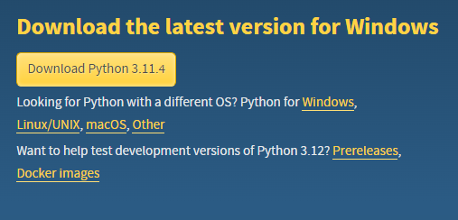
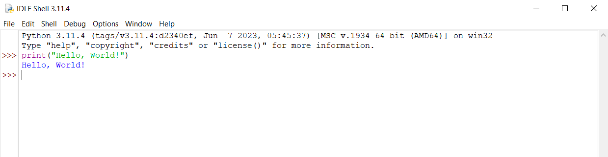
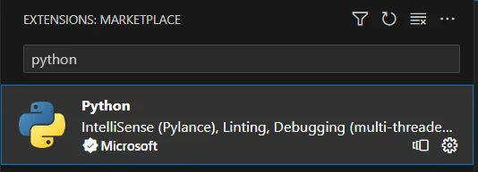
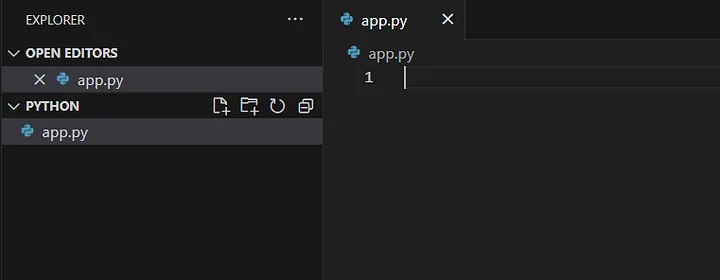
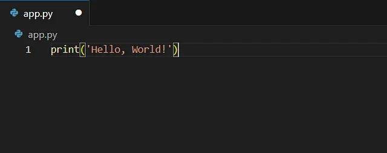

# Python Dersleri
# İçindekiler

## İçindekiler

- [1. Kurulumlar](#1-kurulumlar)
- [2. Değişkenler](#2-değişkenler)
- [3. Temel Fonksiyonlar](#3-temel-fonksiyonlar)
- [4. Veri Tipleri](#4-veri-tipleri)
- [5. Veri Tipleri Dönüşümü](#5-veri-tipleri-dönüşümü)
- [6. Yorum Satırı](#6-yorum-satırı)
- [7. Operatörler](#7-operatörler)
- [8. Koşullar](#8-koşullar)
- [9. Döngüler](#9-döngüler)
- [10. Fonksiyonlar](#10-fonksiyonlar)
- [11. Modüller](#11-modüller)
- [12. Hatalar](#12-hatalar)
- [13. Nesne Yönelimli Programlama (Object Oriented Programming, OOP)](#13-nesne-yönelimli-programlama-object-oriented-programming-oop)
- [14. Dosya İşlemleri](#14-dosya-işlemleri)
- [15. Değerlendirme](#15-değerlendirme)


# 1. Kurulumlar

---

### 1.1. Python

Öncelikle [buradan](https://www.python.org/downloads/) Python'ın sitesine gidiyoruz.



*Download Python 3.11.4* butonuna tıklayarak Python'ın son sürümünü indirebiliriz.

Eğer bilgisayarınızda Python var ise indirdiğiniz dosyayı açtıktan sonra upgrade (yükseltme) etmeniz yeterli olacaktır. Eğer yok ise aşağıdaki adımlar ile devam edebilirsiniz.

İndirdiğimiz dosyaya tıkladıktan sonra karşımıza çıkan ekrandan *Add python.exe to PATH* checkbox'ına bir tick atıyoruz. PATH, komut istemcisine (Command Prompt) veya PowerShell'e yazdığımız komutların local (yerel) olarak nerede bulunacağını belirleyen bir listedir. PATH'e ekledikten sonra *Install Now* ile devam edebiliriz. Ardından kurulum işlemi tamamlanacaktır.

İlk kodumuzu Python IDLE'da yazalım.

Python IDLE (Integrated Development and Learning Environment), Python programlama dilinde kullanılan bir entegre geliştirme ortamıdır.

Bilgisayarınızda "python" veya "idle" araması yaptığınızda IDLE'ı görmüş olacaksınız.



Görüleceği üzere `print()` ile ekrana bir "Hello, World!" yazdırdık. Ancak biz kodlarımızı Visual Studio Code'da yazacağız. Detaya girmeden önce Visual Studio Code'un tek seçenek olmadığı; PyCharm gibi diğer ortamların da kullanılabileceği notunu düşmek isterim.

### 1.2. Visual Studio Code

Visual Studio Code (VS Code), Microsoft tarafından geliştirilen ücretsiz ve açık kaynaklı bir kod editörü ve entegre geliştirme ortamıdır. Birçok programlama dilini destekler ve Windows, macOS ve Linux işletim sistemlerinde kullanılabilir.

[Buradan](https://code.visualstudio.com/) VS Code'un sitesine giderek indirme işlemini başlatabiliriz.


*Download for Windows*'a (ya da siz hangi işletim sistemini kullanıyorsanız ona) tıklayarak indirme işlemini başlatabiliriz. Ardından hiçbir değişikliğe gitmeden kurulum işlemini tamamlayabiliriz.

Kurulumdan sonra VS Code'u açıp solda bulunan *Extensions*'a tıklayıp arama alanına "python" yazıyoruz. Yazdıktan sonra aşağıdaki eklentiyi kuruyoruz. *Install*'a tıklamanız yeterli olacaktır. Bende kurulu olduğu için *Install* butonu görünmüyor.



Bu, Python'ı VS Code'da çalıştırmamız için gerekli olan eklentiydi. Şimdi bir tane dosya açalım. Python dosyalarının uzantısı .py olacak.

Masaüstünde "Python" isminde bir klasör açıyorum ve sürükleyip VS Code'a bırakıyorum. Ardından PYTHON klasörünün yanındaki *New File...* yazan yere tıklayıp *app.py* isminde bir dosya oluşturuyorum.



Script'e bir şeyler yazalım.



Yazdıktan sonra Terminal menüsünden *New Terminal* ile yeni bir terminal açıyoruz.


Açılan terminale aşağıdaki komutu yazdığımızda kodumuz çalışacaktır. İlgili çıktıyı yine terminalden alacağız.

```python
print("Merhaba, dünya!")
```

Açtığımız Python klasörünü sürükleyip bıraktığımız için terminaldeki dizin otomatik olarak Python klasörüne ayarlandı. Eğer bu klasörün içerisinde değilseniz komutlar ile bu dizini tanımlamalısınız. İşte konu ile ilgili iki komut:

Bir geriye gitmek için:

```
cd ..
```

İlgili klasörün içine girmek için:

```
cd Python
```

## 2. Değişkenler

---

Başlamadan VS Code ile ilgili bir bilgi vereyim. Daha önce açtığımız app.py script'inin içinde herhangi bir yere sağ tıklayıp *Run in Interactive Window*'a; oradan da *Run Current File in Interactive Window*'a tıklıyoruz. Kodlarımızı açılan alanda da çalıştırabiliriz. Yine script'e yazın ancak bu ekran da açık kalabilir. Aynı zamanda bu ekranda `print()` ile yazdırmak zorunda değiliz ancak yazmayı alışkanlık edinebiliriz.

Değişkenler bir değeri saklamak veya temsil etmek için kullanılırlar. Bir değişken, verilerin hafızada depolanmasını sağlar ve bu verilere erişmek veya manipüle etmek için kullanılır.

Örnek olarak kendimizi kısaca tanımlayalım. Bu tanımları bir listenin içerisine yazalım. Listeleri daha detaylı inceleyeceğiz.

```python
['Python',1989,'İstanbul','Developer']
```

Yukarıdaki listede kullandığım programlama dilini, doğum yılımı, yaşadığım ili ve mesleğimi tanımladım. Şimdi bunu bir değişkene atayalım. Değişken ismi örneğin twitter hesap ismimiz olabilir. Değerleri değişkene atarken `=` operatörünü kullanacağız.

```python
urazdev = ['Python',1989,'İstanbul','Developer']
```

Bu değerleri tek tek olacak şekilde de tanımlayabilirdik.

```python
dil = 'Python'
dogum_yili = 1989
il = 'İstanbul'
meslek = 'Developer'
```

Depoladığımız bir değeri değişken ismini çağırarak ekrana yazdırabiliriz. Bunu da Python’ın temel fonksiyonlarından olan `print()` ile yapacağız.

```python
print(urazdev)
```

Çıktı aşağıdaki gibi olacaktır.

```
['Python', 1989, 'İstanbul', 'Developer']
```

Değişkenlere isim verirken birtakım kurallara uymak zorundayız. Bunları inceleyelim.

* Özel karakterler kullanmıyoruz.

```python
@dil = 'Python'
```

* Sayı ile başlatmıyoruz.

```python
1degisken = 'Python'
```

* Ancak sayı ekleyebiliriz.

```python
degisken1 = 'Python'
```

* Python’a ait bir ifade kullanmıyoruz.

```python
if = 'Python'
```

* Ancak örneğin başına `_` koyabiliriz.

```python
_if = 'Python'
```

* Türkçe harfler içerebilir ancak bu tavsiye edilmemektedir. Aşağıdaki değişken ismi herhangi bir hataya yol açmayacaktır.

```python
seçenek = 'Python'
```

Değişkenler küçük-büyük harfe duyarlıdır.

```python
degisken = 'd ile başlayan'
Degisken = 'D ile başlayan'

print(degisken)
print(Degisken)
```

Ekranda aşağıdaki çıktıları göreceğiz.

```
d ile başlayan
D ile başlayan
```

Değişkenlere isim vermenin genel kabul görmüş üç yönteminden bahsedebilirim.

* camelCase: Kelime gruplarından ilkine küçük harfler ile başlayıp geri kalan kelimelerin sadece baş harflerini büyük harfle yazdığımız bir isimlendirme yöntemidir.

```
ilkDegisken
benimDegiskenIsmim
```

* snake_case: Kelime grubunun her bir kelimesini küçük harflerle yazdığımız ve kelimelerin arasına `_` eklediğimiz bir isimlendirme yöntemidir.

```
ilk_degisken
benim_degisken_ismim
```

* PascalCase: Kelime grubunun her bir kelimesinin baş harfine büyük harfle başladığımız, ardışık kelimelerin ilk harflerini ise büyük harfle yazdığımız bir isimlendirme yöntemidir.

```
IlkDegisken
BenimDegiskenIsmim
```

Değişkenler ile yapabileceğimiz bazı işlemlere bakalım.

Aşağıdaki değişkenleri örnek olarak alalım.

```python
il = 'İstanbul'
ilce = 'Maltepe'
```

* İki değişkeni birleştirebiliriz.

```python
il = 'İstanbul'
ilce = 'Maltepe'

print(il + ' ' + ilce)
```

Çıktı aşağıdaki gibi olacaktır.

```
İstanbul Maltepe
```

* Bir değişkeni birden fazla yazdırabiliriz.

```python
print(il*3)
```

Çıktı aşağıdaki gibi olacaktır.

```
İstanbulİstanbulİstanbul
```

Yukarıdaki işlemi tırnaklar içerisinde yazılmış bir string ifadeye uyguladığımızda tekrarlı değerleri aldık. Bunu sayısal bir değere yapsaydık tekrarlı değer almayacaktık.

```python
plaka = 34

print(plaka*3)
```

Yani, 34*3 olan `102` sonucunu alacağız.

* İki değişkenin değerleri arasında bir değişim yapabiliriz.

```python
plaka1 = 34
plaka2 = 35

print(plaka1)
print(plaka2)
```

Yukarıdaki iki değişkeni yazdırdığımızda sırasıyla `34` ve `35` değerlerine ulaşacağız. Şimdi yer değiştirelim.

```python
plaka1 = 34
plaka2 = 35

print(plaka1)
print(plaka2)

print('-----')

plaka1, plaka2 = plaka2, plaka1

print(plaka1)
print(plaka2)
```

Çıktı aşağıdaki gibi olacaktır.

```
34
35
-----
35
34
```

* Oluşturduğumuz bir değişkeni daha sonra silebiliriz.

```python
silinecekDegisken = 'eskiler'
print(silinecekDegisken)
```

`print()` ile değişkene atadığımız değeri ekranda göreceğiz ancak aşağıdaki gibi sildiğimizde değişkenin tanımlı olmadığına dair bir hata alacağız.

```python
del silinecekDegisken
print(silinecekDegisken)
```

Çıktı aşağıdaki gibi olacaktır.

```
NameError: name 'silinecekDegisken' is not defined
```

## 3. Temel Fonksiyonlar

---

Temel fonksiyonlar, sık kullanılan işlemleri gerçekleştirmek için Python dilinde yerleşik olarak sunulur. Bazı fonksiyonları inceleyelim.

Aşağıdaki gibi bir değişkenimiz olsun.

```python
ulke = 'Türkiye Cumhuriyeti'
```

* print(): Verilen değeri ekrana yazdırmak için kullanılır.

```python
print(ulke)
```

Buradan, `Türkiye Cumhuriyeti` çıktısını alacağız.

* type(): Bir nesnenin türünü döndürmek için kullanılır.

```python
print(type(ulke))
```

Buradan, `<class 'str'>` çıktısını alacağız.

Değişkenin içindeki değer bir string ifadedir. Çünkü bu değeri tırnaklar içinde yazdık.

Sahip olunan özellikler ve metotlara bakalım.

```python
dir(ulke)
```

Çıktı aşağıdaki gibi olacaktır.

```
['__add__',
 '__class__',
 '__contains__',
 '__delattr__',
 '__dir__',
 '__doc__',
 '__eq__',
 '__format__',
 '__ge__',
 '__getattribute__',
 '__getitem__',
 '__getnewargs__',
 '__getstate__',
 '__gt__',
 '__hash__',
 '__init__',
 '__init_subclass__',
 '__iter__',
 '__le__',
 '__len__',
 '__lt__',
 '__mod__',
 '__mul__',
 '__ne__',
 '__new__',
...
 'swapcase',
 'title',
 'translate',
 'upper',
 'zfill']
```

Peki, burada gördüklerimiz ne işe yarıyor? Bir sonraki fonksiyon yardımı ile bakalım.

* help(): Bir nesnenin belgelemesini görüntülemek için kullanılır. Örneğin, yukarıda gördüğümüz upper’ın tanımına bakalım.

```python
help(str.upper)
```

Çıktı aşağıdaki gibi olacaktır.

```
Help on method_descriptor:

upper(self, /)
    Return a copy of the string converted to uppercase.
```

Buradan harfleri büyük yaptığını anlıyoruz. Yapalım.

```python
str.upper(ulke)
```

Bu durumda değişkene atadığımız değer `'TÜRKIYE CUMHURIYETI'` şeklinde olacaktır.

* len(): Bir nesnenin uzunluğunu veya elemanların sayısını döndürmek için kullanılır.

```python
len(ulke)
```

Çıktı `19` olacaktır.

Harfleri saydığımızda 18 sonucuna ulaşıyoruz. 19 olmasının sebebi boşluğu da bir karakter olarak saymasıdır.

* input(): Kullanıcıdan bir giriş almak için kullanılır.

```python
input('Yaşınız: ')
```

Yukarıdaki kodu çalıştırdığımızda bir tane input alanının açıldığını göreceğiz. Buraya yaş bilgisini girince ekrana girilen değer yazdırılacaktır. Ancak biz bu değeri henüz bir değişkende tutmuyoruz. Tutalım o halde.

```python
yas = input('Yaşınız: ')
```

Şimdi sakladığımız bu değeri ekrana yazdıralım.

```python
yas = input('Yaşınız: ')
print('Yaşınız ' + yas + ' olarak kaydedilmiştir.')
```

Örnek bir sayı girelim ve sonuca bakalım.

```
Yaşınız 34 olarak kaydedilmiştir.
```

## 4. Veri Tipleri

---

### 4.1. NoneType

Boş bir değeri veya olmayan bir değeri tanımlamak için kullanılır. Burada dikkat etmemiz gereken nokta NoneType veri tipi sıfır, False veya boş bir string ile aynı anlama gelmez.

```python
x = None
print(type(x))
```

Görüleceği üzere değişkene None değerini atadık ve veri tipini NoneType olarak aldık. Yani, `<class 'NoneType'>`.

### 4.2. str

Metin veya karakter dizilerini temsil eden veri tipidir. String veri tipini oluşturmanın bazı yöntemlerine bakalım.

* Değeri tek tırnak içine yazarak bir string oluşturabiliriz.

* Değeri çift tırnak içine yazarak bir string oluşturabiliriz.

* Değeri üç tırnak içine yazarak bir string oluşturabiliriz.

* `str()` fonksiyonunu kullanarak bir değeri string'e dönüştürebiliriz.

Her bir maddenin örnekleri aşağıda sırasıyla verilmiştir.

```python
il = 'İstanbul'
print(il)

il = "İstanbul"
print(il)

il = """İstanbul"""
print(il)

plaka = 34
plaka2 = str(plaka)
print(type(plaka))
print(type(plaka2))
```

Dikkat edin; hangi tırnak ile başladıysak o tırnak ile bitirdik. Örneğin, tek tırnak kullanıyorsak tek tırnak ile başlayıp tek tırnak ile bitirmeliyiz.

Yukarıdaki son iki maddeye değinmek istiyorum. İlki, üç tırnak.

Neden tek tırnak veya çift tırnak ile string ifade oluşturmak varken üç tırnak kullanıp zorlanalım ki?

Üç tırnak, tek bir satırda sığmayacak kadar uzun veya birden fazla satıra yayılan string’ler oluşturmamıza olanak sağlar. Böylece kodumuzu daha okunabilir hale getirebiliriz.

```python
degisken = '''Buraya
çok satırlı bir string
yazdım.'''

print(degisken)
```

Çıktı aşağıdaki gibi olacaktır.

```
Buraya
çok satırlı bir string
yazdım.
```

Peki, alt alta yazmanın tek yolu bu mudur? Tabi ki değildir. Aşağıdaki örneğe bakalım.

```python
degisken = 'Buraya\nçok satırlı bir string\nyazdım.'
print(degisken)
```

Görüldüğü üzere `\n` karakterini kullanarak satırı aşağıya kaydırmış olduk. Çıktıya bakalım.

```
Buraya
çok satırlı bir string
yazdım.
```

Üç tırnak içindeki string’lerde tek veya çift tırnak kullanmak zorunda kalmayız. Bu, içinde tırnak karakterleri geçen string’ler oluştururken kolaylık sağlayacaktır.

```python
degisken = """Python programla dili "efsane" değil mi?"""
print(degisken)
```

Çıktı aşağıdaki gibi olacaktır.

```
Python programla dili "efsane" değil mi?
```

Ancak bu ifadeyi aşağıdaki gibi yazsaydık ne olacaktı?

```python
degisken = "Python programla dili "efsane" değil mi?"
print(degisken)
```

Hata alacaktık.

```
    degisken = "Python programla dili "efsane" değil mi?"
                                       ^
SyntaxError: invalid syntax
```

Tabi, ısrarla bu şekilde yazmak istersek bunun da bir çözümü vardır.

```python
degisken = "Python programla dili \"efsane\" değil mi?"
print(degisken)
```

Çift tırnakların başına `\` kaçış ifadesini koyarak hatayı engellemiş olduk. Çıktıyı sağlıklı bir şekilde alabileceğiz.

```
Python programla dili "efsane" değil mi?
```

Üç tırnak kullanmanın temelde faydaları bunlardır. Değinmek istediğim ikinci madde veri tipini dönüştürme.

```python
plaka = 34
plaka2 = str(plaka)
print(type(plaka))
print(type(plaka2))
```

Burada plaka değişkeni bir sonraki alt başlıkta göreceğimiz sayısal bir ifade. Bunu `str()` fonksiyonu ile string’e çevirdik ve diğer değişkene atadık. Çıktılar sırasıyla `<class 'int'>` ve `<class 'str'>` olacaktır.

String'lerde indeksleme işlemlerine bakalım.

İndeksleme yöntemleri, belirli bir karakteri veya karakterlerin bir alt kümesini seçmek için kullanılır.

```python
degisken = 'Python Programlama Dili'
```

* Belirli bir indeksteki karakteri alma

Örneğin, yukarıdaki string'in ilk harfi alalım. İlk değer ya da ilk harf sıfırıncı indekste bulunmaktadır.

```python
print(degisken[0])
```

Bu, bize `P` değerini verecektir.

* Dilimleme ile alt dize alma

Örneğin, yukarıdaki string'ten "Programlama" kelimesini alalım.

```python
print(degisken[7:18])
```

Bu, bize `Programlama` değerini verecektir. Peki, ben sayıyorum 7:17'ye denk geliyor. Neden 7:18 yazdık? Dilimleme yapılırken başlangıç indeksi dahil edilirken, bitiş indeksi dahil edilmez. Bu nedenle 17 yerine 18'i yazdık.

* Negatif indeksleme

Örneğin, yukarıdaki string'in son harfini alalım. Bu durumda 22 yazmak yerine -1 yazabiliriz.

```python
print(degisken[-1])
```

Bu, son harf olan `i`'yi verecektir. Bir başka örnek olarak "Dili" kelimesini dilimleme ile alabiliriz.

```python
print(degisken[-4:])
```

Yukarıda -4 yazdıktan sonra iki nokta koyduk. Bu -4'ten başla, sona (sıfıra) kadar git anlamını taşır. Aynısını pozitif indekslemede de yapabilirdik. Örneğin, "Python" kelimesini alalım.

```python
print(degisken[:6])
```

Burada ise sıfırdan başlattık (yazmadık), iki nokta koyduk ve bitiş indeksi dahil edilmediği için 5+1. indeks olan 6'yı yazdık.

Yeni bir string yazalım.

```python
degisken = '123456789'
```

Burada bulunan çift sayıları alalım. Bunu atlatarak yapacağız.

```python
print(degisken[1:9:2])
```

1 indeksi ile başlattık. Çünkü string'teki en küçük çift sayı olan 2 ile başlamamız gerekiyor. 2 de 1. indekste. Son indeks olan 9'a kadar gittik. Son olarak 2'şer atlattık. Bu durumda alacağımız çıktı `2468` olacaktır.

Yukarıda 9'u yazmamıza gerek var mıydı? Bunu yazmak yerine orayı boş da bırakabilirdik. Bu zaten sona kadar git demekti.

```python
print(degisken[1::2])
```

Bu da yine aynı çıktıyı verecektir.

Örnekler çoğaltılabilir. Asıl olan mantığın oturmasıdır. Peki, bu mantıkla son yazdığımız string’i tersten nasıl yazabiliriz? Düşünelim.

Önce hepsini alırız. Bu durumda herhangi bir sayı yazmamıza gerek olmayacak.

```python
print(degisken[::])
```

Yine aynı sonucu alacağız: `123456789`. Peki, atlatmayı 1'er yapsak?

```python
print(degisken[::1])
```

Yine aynı sonuç. Atlatmayı tersten yapsak?

```python
print(degisken[::-1])
```

İşte bu durumda string'i ters çevirmiş olacağız. Yani, sonuç `987654321` olacak.

Şimdi bir de formatlama yöntemlerine bakalım.

```python
ulke = 'Türkiye Cumhuriyeti'
baskent = 'Ankara'
yil = 100
```

* format() string metodu ile formatlama:

```python
print("{}'nin başkenti {}'dır.".format(ulke,baskent))
```

Tırnaklar içerisine süslü parantezler ekledik ve `.format()` ile sırasıyla süslü parantezlerin içerisine gelecek değişkenleri belirledik.

Çıktı aşağıdaki gibi olacaktır.

```
Türkiye Cumhuriyeti'nin başkenti Ankara'dır.
```

* F-string formatlama:

```python
print(f"{ulke}'nin başkenti {baskent}'dır.")
```

Tırnak öncesi f koyarak süslü parantezlerin içerisine gelecek değişkenleri koyduk.

Çıktı aşağıdaki gibi olacaktır.

```
Türkiye Cumhuriyeti'nin başkenti Ankara'dır.
```

* % operatörü ile formatlama:

```python
print("%s'nin başkenti %s'dır. Cumhuriyetimiz %d. yılındadır." % (ulke, baskent, yil))
```

`%s` ile string; `%d` ile sayısal bir değişken olduğunu belirledik. `%` operatöründen sonra parantezler içerisinde sırasıyla bu değişkenleri belirledik.

Çıktı aşağıdaki gibi olacaktır.

```
Türkiye Cumhuriyeti'nin başkenti Ankara'dır. Cumhuriyetimiz 100. yılındadır.
```

Metotlara geçmeden önce `print()` ile string ifadeler üzerinden yapabileceğimiz bazı işlemlere bakalım.

```python
degisken = 'python'
```

* String bir ifadeyi `-` ile ayırabiliriz.

```python
print(*degisken, sep="-")
```

Çıktı aşağıdaki gibi olacaktır.

```
p-y-t-h-o-n
```

* String bir ifadeyi alt alta yazabiliriz.

```python
print(*degisken, sep="\n")
```

Çıktı aşağıdaki gibi olacaktır.

```
p
y
t
h
o
n
```

* String bir ifadede boşluklar bırakabiliriz.

```python
print(*degisken, sep="\t")
```

Çıktı aşağıdaki gibi olacaktır.

```
p y t h o n
```

Hepsinin başında `*` olduğuna dikkat edelim.

Son olarak string'lerdeki bazı metotlara bakalım.

```python
degisken1 = 'python'
degisken2 = 'Python'
degisken3 = 'python programlama dili'
degisken4 = 'Python,Programlama,Dili'
```

Değişken ismini yazdıktan sonra nokta koyarsanız metotlara ulaşabilirsiniz.

* capitalize(): İlk harfi büyük, diğer harfleri küçük hale getirir.

```python
print(degisken1.capitalize())
```

`Python` sonucunu verecektir.

* lower(): Tüm harfleri küçük hale getirir.

```python
print(degisken2.lower())
```

`python` sonucunu verecektir.

* upper(): Tüm harfleri büyük hale getirir.

```python
print(degisken1.upper())
```

`PYTHON` sonucunu verecektir.

* swapcase(): Büyük harfleri küçük, küçük harfleri büyük hale getirir.

```python
print(degisken2.swapcase())
```

`pYTHON` sonucunu verecektir.

* title(): Her kelimenin ilk harfini büyük hale getirir.

```python
print(degisken3.title())
```

`Python Programlama Dili` sonucunu verecektir.

* count(): Belirtilen alt dizgenin kaç kez geçtiğini sayar.

```python
print(degisken3.count("p"))
```

p harfi `2` defa geçmiştir.

* startswith(): Belirtilen prefiks ile başlayıp başlamadığını kontrol eder.

```python
print(degisken3.startswith("python"))
```

`True` sonucunu verecektir. Daha sonra göreceğimiz bu mantıksal ifade doğru anlamındadır. Yani, "python" ile başlıyor. Eğer öyle olmasaydı `False` döndürecekti.

* endswith(): Belirtilen suffiks ile bitip bitmediğini kontrol eder.

```python
print(degisken3.endswith("python"))
```

`False` sonucunu verecektir. Daha sonra göreceğimiz bu mantıksal ifade yanlış anlamındadır. Yani, "python" ile bitmiyor. Eğer öyle olsaydı `True` döndürecekti.

* find(): Belirtilen alt dizgenin indeksini bulur (ilk bulduğu indeksi döner). Eğer alt dize bulunamazsa -1 döner.

```python
print(degisken1.find("y"))
```

`1` sonucunu dönecektir. Çünkü "y" 1. indekstedir. İndekslerin sıfır ile başladığını unutmayalım.

Aşağıdaki ise olmadığı için sonucu `-1` dönecektir.

```python
print(degisken1.find("javascript"))
```

* replace(): Belirtilen eski alt dizgeyi yeni alt dizeyle değiştirir.

```python
print(degisken3.replace("python", "java"))
```

python programlama dili, `java programlama dili` olacaktır.

* split(): Belirtilen ayraç karakterine göre dizgeyi böler ve bir liste döner.

```python
print(degisken4.split(","))
```

Yukarıdaki işlem aşağıdaki gibi bir liste verecektir.

```
['Python', 'Programlama', 'Dili']
```

* join(): Belirtilen yinelenebilir elemanları birleştirerek bir dizge oluşturur.

Bir önceki örnekte bulunan split() metodunu alarak sonucu bir değişkene atayalım. Çünkü bir listeye ihtiyacımız olacak.

```python
degisken5 = degisken4.split(",")
```

Bu listede bulunan elemanları alarak aralarında boşluk olacak şekilde birleştirelim.

```python
print(" ".join(degisken5))
```

Bu işlem bize aşağıdaki sonucu dönecektir.

```
Python Programlama Dili
```

String veri tipine ait bazı metotları görmüş olduk.

### 4.3. int

int, tam sayıları temsil eder.

```python
sayi = 9
print(type(sayi))
```

9 bir tam sayıdır ve veri tipi `<class 'int'>` olacaktır.

Boş bir tam sayı oluşturmak için `int()` kullanılır. İçine, örneğin bir string ifade yazdığımızda bunu tam sayıya çevirir. İlk `print()`’in `10` döndürmesini bekleriz.

```python
sayi = int('10')
print(sayi)
print(type(sayi))
```

### 4.4. float

float, ondalıklı sayıları temsil eder.

```python
sayi = 3.14
print(type(sayi))
```

3.14 bir ondalıklı sayıdır ve veri tipi `<class 'float'>` olacaktır.

Boş bir ondalıklı sayı oluşturmak için `float()` kullanılır. İçine, örneğin bir tam sayı yazdığımızda bunu ondalıklı sayıya çevirir. İlk `print()`’in `10.0` döndürmesini bekleriz.

```python
sayi = float('10')
print(sayi)
print(type(sayi))
```

### 4.5. complex

complex, gerçek ve sanal bileşenlerden oluşan karmaşık sayıları temsil eder.

```python
sayi = 3 + 2j
print(type(sayi))
```

3 + 2j bir karmaşık sayıdır ve veri tipi `<class 'complex'>` olacaktır.

Boş bir karmaşık sayı oluşturmak için `complex()` kullanılır. İçine, örneğin gerçek bir sayı yazdığımızda bunu kompleks sayıya çevirir. İlk `print()`'in `10+0j` döndürmesini bekleriz.

```python
sayi = complex(10)
print(sayi)
print(type(sayi))
```

### 4.6. bool (boolean)

bool (boolean), mantıksal değerleri temsil etmek için kullanılan bir veri tipidir. İki değere sahiptir: `True` (doğru) ve `False` (yanlış).

```python
deger = True
print(type(deger))
```

True bir mantıksal değerdir ve veri tipi `<class 'bool'>` olacaktır.

Boş bir mantıksal ifade oluşturmak için `bool()` kullanılır. İçine, örneğin bir tam sayı yazdığımızda bunu mantıksal ifadeye çevirir. İlk `print()`'in `True` döndürmesini bekleriz.

```python
deger = bool(10)
print(deger)
print(type(deger))
```

Neden True döndürüyor? 10 bir sayısal değerdir ve sıfırdan farklıdır. Python'da sıfır dışındaki tüm sayılar True olarak değerlendirilir. Dolayısıyla bool(10) ifadesi True olarak değerlendirilir.

*Aşağıda, bir işlemi önceki işlemlerden bağımsız yapmayacağız. O nedenle, bir işlem son yapılan değişikliklerden etkilenerek sonuç dönecektir.*

### 4.7. list (Liste)

list, birden çok elemanı bir arada saklamak için kullanılan bir veri tipidir. Bir listede farklı veri tiplerine sahip elemanlar bulunabilir. Listeler, köşeli parantezler `[]` içine alınarak oluşturulur.

* Boş bir liste:

```python
bos_liste = []
```

* Farklı veri tiplerine sahip elemanlar içeren bir liste:

```python
liste = [-1, "python", 3.14, True]
```

* Farklı veri tiplerine sahip elemanlar ve aynı zamanda liste de içeren bir liste:

```python
liste = [-1, "python", 3.14, True, [0, False]]
```

Yukarıdaki tüm örnekler birer listedir.

```python
print(type(liste))
```

Liste veri tipi list olarak verilir. Yani, `<class 'list'>` .

Listelerde indekslemeye bakalım.

```python
liste = [-1, "python", 3.14, True, [0, False]]
```

* Listenin ilk elemanını almak için sıfırı kullanıyoruz.

```python
print(liste[0])
```

Buradan `-1` sonucunu alacağız.

* Liste içerisinde değişiklik yapabiliriz.

```python
liste[3] = False
print(liste)
```

İndeksi 3 olan True elemanını False olarak değiştirdik. Bu durumda sonuç `[-1, 'python', 3.14, False, [0, False]]` dönecektir.

* Liste içerisindeki listede de değişiklik yapabiliriz.

```python
liste[4][0] = 1
print(liste)
```

Örnekte bulunan listenin içerisindeki listenin indeksi 4'tür. Bunu tek bir eleman olarak düşünüyoruz. İçerideki listeye ulaştıktan sonra bu defa orada da indekslemeye devam ediyoruz. Değiştirmek istediğimiz eleman 0 ve bunun da indeksi 0 olduğu için yukarıdaki gibi [4][0] yazıyoruz. Çalıştırdığımızda bize `[-1, 'python', 3.14, False, [1, False]]` sonucunu verecektir.

Liste üzerinde dilimleme de yapabiliriz.

```python
print(liste[:3])
```

İlk üç elemanı aldık. Baştan başladığı için `:` 'nın solunu boş bıraktık. Aslında orası sıfır demektir. Sağına ise 2 yerine 3 yazdık. Çünkü bitiş indeksi sayılmıyor. Yani, 3.14 elemanı 2. indekste iken son indeks sayılmadığı için 3 olarak yazıyoruz. Çalıştırdığımızda `[-1, 'python', 3.14]` sonucunu alacağız.

```python
print(liste[::2])
```

Yukarıda sıfırıncı adımdan başlayarak ve listede iki adım atlayarak elemanları seçtirdik. Bu durumda alacağımız değerler `[-1, 3.14, [1, False]]` olacaktır.

```python
print(liste[::-1])
```

Yukarıdaki dilimleme tipi de tersten yazdıracaktır. Yani, `[[1, False], False, 3.14, 'python', -1]` sonucu dönecektir.

Liste veri tipinde kullanılan bazı metotlara bakalım. Metotlara ulaşmak için değişkenden sonra `.` koyuyoruz.

```python
liste1 = [-1, "python", 3.14, True, [0, False]]
liste2 = [2,4,6]
liste3 = [1,1,3,3,3,3,5,5,7,7,9]
liste4 = [3,3,2,1,1,1,9,8,7]
```

* append(): Bir listeye yeni bir eleman ekler.

```python
liste1.append(9)
print(liste1)
```

Eklemek istediğimiz 9 değerini listenin sonuna ekleyecek ve `[-1, 'python', 3.14, True, [0, False], 9]` sonucunu dönecektir.

* extend(): Bir listedeki elemanları başka bir listeyle genişletir.

```python
liste1.extend(liste2)
print(liste1)
```

İkinci listeye ait elemanları ilk listenin sonuna ekleyecek ve `[-1, 'python', 3.14, True, [0, False], 9, 2, 4, 6]` sonucunu dönecektir.

* insert(): Belirli bir konuma yeni bir eleman ekler.

```python
liste2.insert(1, 6)
print(liste2)
```

İndeksi 1 olan yere 6 değerini ekleyecek ve `[2, 6, 4, 6]` sonucunu dönecektir.

* remove(): Belirli bir değere sahip olan ilk elemanı listeden kaldırır.

```python
liste2.remove(6)
print(liste2)
```

Listede iki tane 6 varken ilk 6'yı kaldıracak ve `[2, 4, 6]` sonucunu dönecektir.

* pop(): Belirli bir konumda bulunan elemanı listeden çıkarır ve döndürür.

```python
liste2.pop(1)
print(liste2)
```

İndeksi 1 olan elemanı silecek ve `[2, 6]` sonucunu dönecektir.

* index(): Belirli bir değere sahip olan ilk elemanın konumunu döndürür.

```python
konum = liste3.index(5)
print(konum)
```

5 değerine sahip ilk elemanın indeks numarası `6` olarak dönecektir.

* count(): Belirli bir değere sahip olan elemanların sayısını döndürür.

```python
adet = liste3.count(3)
print(adet)
```

Listede dört adet 3 olduğu için sonuç `4` dönecektir.

* sort(): Listeyi sıralar.

```python
liste4.sort()
print(liste4)
```

Yukarıda küçükten büyüğe doğru sıralama yapacak ve `[1, 1, 1, 2, 3, 3, 7, 8, 9]` sonucunu dönecektir.

Burada büyükten küçüğe doğru da sıralama yapabilirdik.

```python
liste4.sort(reverse=True)
print(liste4)
```

Sonuç `[9, 8, 7, 3, 3, 2, 1, 1, 1]` olacaktır.

* reverse(): Listeyi tersine çevirir.

```python
liste4.reverse()
print(liste4)
```

Listede yapılan son değişiklik ile beraber liste tersine çevrilecek ve `[1, 1, 1, 2, 3, 3, 7, 8, 9]` sonucunu dönecektir.

Listelerde son olarak kullanılabilecek bazı fonksiyonlara bakalım.

* len(): Listenin eleman sayısını döndürür.

```python
print(len(liste3))
```

Sonucu `11` olarak dönecektir.

* max(): Listenin en büyük elemanını döndürür.

```python
print(max(liste3))
```

Sonucu `9` olarak dönecektir.

* min(): Listenin en küçük elemanını döndürür.

```python
print(min(liste3))
```

Sonucu `1` olarak dönecektir.

* sum(): Listenin elemanlarının toplamını döndürür.

```python
print(sum(liste3))
```

Sonucu `47` olarak dönecektir.

### 4.8. tuple (Demet)

Demetlerin listelerden farkı, demetler, oluşturulduktan sonra değiştirilemez olarak kabul edilir. Yani, bir demetin içindeki elemanları değiştiremeyiz. Öte yandan, listeler değiştirilebilir olarak kabul edilir. Bunun yanında, demetler normalde parantezler `()` içinde tanımlanırken, listeler köşeli parantezler `[]` içinde tanımlanır.

* Boş bir demet:

```python
bos_demet = ()
```

* Farklı veri tiplerine sahip elemanlar içeren bir demet:

```python
demet = (3, 2, 1, "mutlu yıllar", True)
```

* Farklı veri tiplerine sahip elemanlar ve aynı zamanda demet de içeren bir demet:

```python
demet = (3, 2, 1, "mutlu yıllar", True, (0, False))
```

Yukarıdaki tüm örnekler birer demettir.

```python
print(type(demet))
```

Demet veri tipi tuple olarak verilir. Yani, `<class 'tuple'>` .

Demetlerde indekslemeye bakalım. Listelerde yeterince gördüğümüz için tek bir örnek vermek istiyorum.

```python
print(demet[0])
```

Yukarıdaki sonuç `3` olarak dönecektir.

Demetlerin metotlarına bakalım.

```python
demet1 = (3, 2, 1, "mutlu yıllar", True, (0, False))
demet2 = (1, 1, 1, 3, 3, 2, 2, 5, 5)
```

* index(): Belirli bir değerin demet içindeki ilk indeksini döndürür.

```python
konum = demet1.index(1)
print(konum)
```

1 sayısının demet içindeki indeks değeri `2` olarak dönecektir.

* count(): Belirli bir değerin demet içinde kaç kez geçtiğini sayar.

```python
adet = demet2.count(3)
print(adet)
```

3 sayısının demet içindeki adeti `2` olarak dönecektir.

Demetlerle ilgili son olarak bir tane fonksiyon örneği görelim.

```python
print(len(demet2))
```

Yukarıda bir demetin uzunluğuna ya da eleman sayısına bakmış olduk. Sonuç `9` dönecektir.

### 4.9. set (Küme)

Küme, benzersiz ve değiştirilebilir elemanların bir koleksiyonunu temsil eder. Kümeler süslü parantezler `{}` ile tanımlanırlar.

* Boş bir küme:

İçi boş süslü parantezler ile küme oluşturamıyoruz. Örneğin, `bos_kume = {}` yaptığımızda bunun tipi birazdan göreceğimiz `dict` olacaktır. Oysa kümelerin veri tipi `set` 'tir.

Ama aşağıdaki gibi yazarsak bir küme tanımlayabiliriz. Elemanların benzersiz olduğuna dikkat edelim.

```python
kume = {1, 2, 3}
```

Kümelerin metotlarına bakalım.

```python
kume1 = {1, 2, 3}
kume2 = {4, 5, 6}
kume3 = {0, 3, 8}
kume4 = {5, 6, 7}
```

* add(): Kümeye bir eleman ekler.

```python
kume1.add(1)
print(kume1)
```

Yukarıdaki metodu çalıştırdığımızda küme yine `{1,2,3}` olarak dönecektir. Çünkü 1 zaten vardı. Ama örneğin, 9 eklediğimizde `{1,2,3,9}` olacaktır.

```python
kume1.add(9)
print(kume1)
```

* difference(): Kümenin başka bir kümeden farkını döner.

```python
print(kume1.difference(kume3))
```

İlk küme ile üçüncü küme arasında 1, 2 ve 9 değerlerinde ortaklık yoktur. Yani, sonuç `{1,2,9}` olarak dönecektir.

Eğer çıkan sonucu direkt olarak ilk kümeye atamak istersek aşağıdaki metodu kullanacağız.

* difference_update(): Kümenin başka bir kümeden farkını alır ve kümenin kendisini bu sonuçla günceller.

```python
kume1.difference_update(kume3)
print(kume1)
```

İlk küme `{1,2,9}` olarak güncellenecektir.

Eğer farklarını değil de kesişimlerini almak istersek aşağıdaki metodu kullanacağız.

* intersection(): İki kümenin kesişimini döner.

```python
print(kume2.intersection(kume4))
```

İkinci küme ile dördüncü kümenin ortak elemanları 5 ve 6 olacağı için `{5,6}` dönecektir.

Eğer bu sonucu ikinci kümeye kaydetmek istersek aşağıdaki metodu kullanacağız.

* intersection_update(): İki kümenin kesişimini alır ve kümenin kendisini bu sonuçla günceller.

```python
kume2.intersection_update(kume4)
print(kume2)
```

Sonucu `{5,6}` olarak dönecektir.

İlk metot ile eklediğimiz 9 elemanını aşağıdaki gibi kaldırabiliriz.

* discard(): Kümeden bir elemanı çıkarır.

```python
kume1.discard(9)
print(kume1)
```

Sonuç `{1,2}` olarak dönecektir.

### 4.10. dict (Sözlük)

Sözlük veri tipi, anahtar-değer çiftlerini depolayan bir veri yapısıdır. Sözlükler süslü parantezler `{}` kullanılarak oluşturulur ve anahtarlarla ilişkilendirilmiş değerleri tutarlar. Her anahtarın benzersiz olması gerekmektedir.

* Boş bir sözlük:

```python
bos_sozluk = {}
```

Sözlük veri tipini anahtar-değer çifti olacak şekilde yazıyoruz demiştik. Örneğine bakalım.

```python
# {} yazdıktan sonra alanı açmak için { ile } arasındayken enter'a basın.

sozluk = {
    "anahtar1":"deger1",
    "anahtar2":"deger2",
    "anahtar3":"deger3"
}

print(type(sozluk))
```

Sözlük veri tipi dict olarak verilir. Yani, `<class 'dict'>` .

Eğer bir anahtarın değerine ulaşmak istersek indekslemeye benzer şekilde yazacağız.

```python
print(sozluk["anahtar1"])
```

Sonuç, `deger1` olarak dönecektir.

Bu değeri değiştirebiliriz.

```python
sozluk["anahtar1"] = "deger_1"
print(sozluk)
```

Daha önce `deger1` olan çıktı `deger_1` olarak güncellenecektir.

Sözlük veri tipinin bazı metotlarına bakalım.

* items(): Sözlükteki tüm anahtar-değer çiftlerini içeren bir liste döndürür.

```python
print(sozluk.items())
```

Çıktısı aşağıdaki gibi olacaktır.

```
dict_items([('anahtar1', 'deger_1'), ('anahtar2', 'deger2'), ('anahtar3', 'deger3')])
```

* keys(): Sözlükteki tüm anahtarları içeren bir liste döndürür.

```python
print(sozluk.keys())
```

Çıktısı aşağıdaki gibi olacaktır.

```
dict_keys(['anahtar1', 'anahtar2', 'anahtar3'])
```

* values(): Sözlükteki tüm değerleri içeren bir liste döndürür.

```python
print(sozluk.values())
```

Çıktısı aşağıdaki gibi olacaktır.

```
dict_values(['deger_1', 'deger2', 'deger3'])
```

* pop(): Belirtilen anahtara sahip değeri sözlükten çıkarır ve döndürür.

```python
sozluk.pop("anahtar1")
print(sozluk)
```

Çıktısı aşağıdaki gibi olacaktır.

```
{'anahtar2': 'deger2', 'anahtar3': 'deger3'}
```

## 5. Veri Tipleri Dönüşümü

---

Bir veri tipini;

* String'e çevirmek için `str()`

Örneğin, int veri tipinden str veri tipine dönüşüm yapalım.

```python
deger = 123
yeni_deger = str(deger)

print(yeni_deger)
print(type(yeni_deger))
```

Çıktı sırasıyla `123` ve `<class 'str'>` olacaktır.

* Integer'a çevirmek için `int()`

Örneğin, str veri tipinden int veri tipine dönüşüm yapalım.

```python
deger = '123'
yeni_deger = int(deger)

print(yeni_deger)
print(type(yeni_deger))
```

Çıktı sırasıyla `123` ve `<class 'int'>` olacaktır.

* Float'a çevirmek için `float()`

Örneğin, str veri tipinden float veri tipine dönüşüm yapalım.

```python
deger = '123'
yeni_deger = float(deger)

print(yeni_deger)
print(type(yeni_deger))
```

Çıktı sırasıyla `123.0` ve `<class 'float'>` olacaktır.

* Complex'e çevirmek için `complex()`

Örneğin, str veri tipinden complex veri tipine dönüşüm yapalım.

```python
deger = '123'
yeni_deger = complex(deger)

print(yeni_deger)
print(type(yeni_deger))
```

Çıktı sırasıyla `(123+0j)` ve `<class 'complex'>` olacaktır.

* Bool'a çevirmek için `bool()`

Örneğin, str veri tipinden bool veri tipine dönüşüm yapalım.

```python
deger = '123'
yeni_deger = bool(deger)

print(yeni_deger)
print(type(yeni_deger))
```

Çıktı sırasıyla `True` ve `<class 'bool'>` olacaktır.

* List'e çevirmek için `list()`

Örneğin, str veri tipinden list veri tipine dönüşüm yapalım.

```python
deger = '123'
yeni_deger = list(deger)

print(yeni_deger)
print(type(yeni_deger))
```

Çıktı sırasıyla `['1', '2', '3']` ve `<class 'list'>` olacaktır.

* Tuple'a çevirmek için `tuple()`

Örneğin, str veri tipinden tuple veri tipine dönüşüm yapalım.

```python
deger = '123'
yeni_deger = tuple(deger)

print(yeni_deger)
print(type(yeni_deger))
```

Çıktı sırasıyla `('1', '2', '3')` ve `<class 'tuple'>` olacaktır.

* Set'e çevirmek için `set()`

Örneğin, str veri tipinden set veri tipine dönüşüm yapalım.

```python
deger = '123'
yeni_deger = set(deger)

print(yeni_deger)
print(type(yeni_deger))
```

Çıktı sırasıyla `{'3', '2', '1'}` ve `<class 'set'>` olacaktır.

*Dictionary'yi atlıyoruz.*

## 6. Yorum Satırı

---

* Yorum satırları, Python yorumlayıcısı tarafından görmezden gelinir. Yani, yorum satırları programın çalışmasını etkilemez. Bu nedenle, kodumuzdaki yorum satırları, kodu anlamak için kullanılan açıklamalar içerir.

* Yorum satırları, kodun farklı bölümlerini açıklamak veya geçici olarak devre dışı bırakmak için kullanılabilir. Bu, hata ayıklama sürecinde veya belirli bir kod bloğunu geçici olarak devre dışı bırakmak istediğimiz durumlarda faydalı olabilir.

* Python'da yorum satırları `#` karakteriyle başlar. `#` karakterinden sonra gelen her şey yorum olarak kabul edilir. Python, `#` karakterinden sonraki tüm satırı yorum olarak ele alır.

```python
# Bu bir yorum satırıdır.
print("Test!")  # Bu da bir yorum satırıdır.

# Aşağıdaki kod çalışmayacaktır.
# print("Test!")
```

* Çok satırlı yorumlar için her satırı `#` karakteriyle başlatmamız gerekir. Bunun yerine, üç adet tırnak işareti (''' veya """) kullanarak bir string ifadesi içinde yorumlarımızı yazabiliriz.

```python
"""
Bu
bir
çok satırlı
yorumdur.
"""
```

## 7. Operatörler

---

### 7.1. Aritmetik Operatörler

```python
sayi1 = 10
sayi2 = 3
```

* Toplama: + işareti ile gerçekleştirilir.

```python
print(sayi1 + sayi2)
```

Çıktı: `13`

* Çıkarma: - işareti ile gerçekleştirilir.

```python
print(sayi1 - sayi2)
```

Çıktı: `7`

* Çarpma: * işareti ile gerçekleştirilir.

```python
print(sayi1 * sayi2)
```

Çıktı: `30`

* Bölme: / işareti ile gerçekleştirilir.

```python
print(sayi1 / sayi2)
```

Çıktı: `3.3333333333333335`

* Tam Sayı Bölme: // işareti ile gerçekleştirilir. Bu operatör, bölme işleminden sonra en büyük tam sayıya yuvarlar.

```python
print(sayi1 // sayi2)
```

Çıktı: `3`

* Mod Alma: % işareti ile gerçekleştirilir. Bu operatör, bir sayının diğer sayıya bölümünden kalanı verir.

```python
print(sayi1 % sayi2)
```

Çıktı: `1`

* Üs Alma: ** işareti ile gerçekleştirilir. Bu operatör, bir sayının üssünü alır.

```python
print(sayi1 ** sayi2)
```

Çıktı: `1000`

### 7.2. Atama Operatörleri

* Eşittir (=)

```python
x = 100
print(x)
```

Çıktı: `100`

* Topla ve ata (+=)

```python
x = 100
x += 5 # x = x + 5 ile aynıdır
print(x)
```

Çıktı: `105`

* Çıkar ve ata (-=)

```python
x = 100
x -= 5 # x = x - 5 ile aynıdır
print(x)
```

Çıktı: `95`

* Çarp ve ata (*=)

```python
x = 100
x *= 5 # x = x * 5 ile aynıdır
print(x)
```

Çıktı: `500`

* Böl ve ata (/=)

```python
x = 100
x /= 5 # x = x / 5 ile aynıdır
print(x)
```

Çıktı: `20.0`

* Modül ve ata (%=)

```python
x = 102
x %= 5 # x = x % 5 ile aynıdır
print(x)
```

Çıktı: `2`

* Tam böl ve ata (//=)

```python
x = 102
x //= 5 # x = x // 5 ile aynıdır
print(x)
```

Çıktı: `20`

* Üs al ve ata (**=)

```python
x = 5
x **= 5 # x = x ** 5 ile aynıdır
print(x)
```

Çıktı: `3125`

### 7.3. Karşılaştırma Operatörleri

`True`: Doğru

`False`: Yanlış

* Eşittir (==)

```python
print(1 == 2)
```

Çıktı: 1 sayısı 2 sayısına eşit olmadığı için `False`

* Eşit değildir (!=)

```python
print(1 != 2)
```

Çıktı: 1 sayısı 2 sayısına eşit olmadığı için `True`

* Büyüktür (>)

```python
print(1 > 2)
```

Çıktı: 1 sayısı 2 sayısından büyük olmadığı için `False`

* Küçüktür (<)

```python
print(1 < 2)
```

Çıktı: 1 sayısı 2 sayısından küçük olduğu için `True`

* Büyük veya eşit (>=)

```python
print(2 >= 2)
```

Çıktı: 2 sayısı 2 sayısına eşit olduğu için `True`

* Küçük veya eşit (<=)

```python
print(3 <= 2)
```

Çıktı: 3 sayısı 2 sayısından küçük veya 2 sayısına eşit olmadığı için `False`

### 7.4. Mantıksal Operatörler

```python
x = -1
y = 0
z = 1
```

* Ve (and): Her iki ifadenin de doğru olması durumunda sonucu True döndürür. Aksi halde sonuç False olur.

```python
print(x < y and y == z)
```

Çıktı: x, y'den küçük ve y, z'ye eşit koşulunda ikincisi koşulu bozduğu için `False`

* Veya (or): En az bir ifadenin doğru olması durumunda sonucu True döndürür. Eğer hiçbiri doğru değilse sonuç False olur.

```python
print(x == y or y < z)
```

Çıktı: x, y'ye eşit veya y, z'den küçük koşulunda ikincisi koşulu sağladığı için `True`

* Değil (not): Bir ifadenin değilini (tersini) alır. Eğer ifade doğru ise sonuç False, yanlış ise sonuç True olur.

```python
print(not(x > y))
```

Çıktı: x, y'den büyük değildir koşulu sağlandığı için `True`

### 7.5. Kimlik Operatörleri

```python
x = 1
y = 1
```

* Eşit mi (is): İki değişkenin aynı kimliğe sahip olup olmadığını kontrol eder. Eğer aynı kimliğe sahiplerse sonuç True, aksi halde sonuç False olur.

```python
print(id(x))
print(id(y))

print(x is y)
```

Çıktı: 1'in id'si 140731487347496 olarak verilmiştir ve her ikisi de aynı id'ye sahip yani eşit olduğu için `True` dönecektir.

* Eşit değil mi (is not): İki değişkenin veya nesnenin farklı kimliklere sahip olup olmadığını kontrol eder. Eğer farklı kimliklere sahiplerse sonuç True, aksi halde sonuç False olur.

```python
print(id(x))
print(id(y))

print(x is not y)
```

Çıktı: 1'in id'si 140731487347496; 2'nin id'si 140731487347528 olarak verilmiştir ve her ikisi de farklı id'lere sahip yani eşit olmadığı için `True` dönecektir.

### 7.6. Üyelik Operatörleri

```python
liste = ['python',0,True]
```

* İçeriyor mu (in): Bir elemanın varlığını kontrol eder. Eğer varsa sonuç True, aksi halde sonuç False olur.

```python
print('java' in liste)
```

Çıktı: `False`

* İçermiyor mu (not in): Bir elemanın yokluğunu kontrol eder. Eğer yoksa sonuç True, aksi halde sonuç False olur.

```python
print('java' not in liste)
```

Çıktı: `True`

## 8. Koşullar

---

`if`, `elif` ve `else` ifadeleri, belirli koşullara dayalı olarak farklı işlemlerin gerçekleştirilmesini sağlayan bir kontrol yapısıdır. Bu yapının kullanımı, belirli bir şartın doğru veya yanlış olmasına bağlı olarak farklı kod bloklarının çalıştırılmasını sağlar.

```
if koşul1:
    # koşul1 doğru ise burası çalışacak
    işlem1
elif koşul2:
    # koşul1 yanlış, koşul2 doğru ise burası çalışacak
    işlem2
elif koşul3:
    # koşul1 ve koşul2 yanlış, koşul3 doğru ise burası çalışacak
    işlem3
else:
    # Hiçbir koşul doğru değilse burası çalışacak
    işlem4
```

Burada, koşul1, koşul2 ve koşul3 gibi ifadeler, değeri True veya False olan koşulları temsil eder. Eğer bir koşul doğru ise o blok içerisindeki işlemler gerçekleştirilir ve kontrol yapısı sona erer. Eğer bir koşul yanlış ise bir sonraki elif veya else bloğuna geçilir.

Bir yaş kontrolü örneği yapalım.

```python
yas = int(input("Yaşınızı girin: "))

if yas < 18:
    print("Ehliyet almak için henüz çok gençsiniz!")
elif yas >= 18 and yas < 65:
    print("Ehliyet alabilirsiniz.")
else:
    print("Emekli olduğunuz için ehliyet almanız gerekmez.")
```

Bu örnekte, kullanıcıdan alınan yaş değeri, if-elif-else yapısı içerisindeki koşullara göre kontrol edilir. Hangi koşulun doğru olduğuna bağlı olarak uygun mesaj ekrana yazdırılır. Örnek olarak, yaşı 18 girelim. Bu durumda alacağımız çıktı `Ehliyet alabilirsiniz.` olacaktır.

Örneğimizi biraz daha geliştirelim ve bir Vücut Kitle Endeksi uygulaması yapalım.

```python
boy = float(input("Boyunuz (metre cinsinden): "))
kilo = float(input("Kilonuz (kilogram cinsinden): "))

vke = round(kilo / (boy ** 2), ndigits=1)

if vke < 18.5:
    print(f"Vücut Kitle Endeksi: {vke} ---> Durum: Zayıf")
elif vke >= 18.5 and vke < 25:
    print(f"Vücut Kitle Endeksi: {vke} ---> Durum: Normal")
elif vke >= 25 and vke < 30:
    print(f"Vücut Kitle Endeksi: {vke} ---> Durum: Fazla Kilolu")
elif vke >= 30:
    print(f"Vücut Kitle Endeksi: {vke} ---> Durum: Obez")
```

Yukarıda, kullanıcından boy ve kilo bilgisini aldık ve hesaplayıp koşula dahil ettik. İnceleyelim.

Örnek olarak değerleri 1.80 boy ve 70 kilo olarak girelim. Bu durumda çıktının `Vücut Kitle Endeksi: 21.6 ---> Durum: Normal` olmasını bekleriz.

* VKE, 18.5'den küçük mü? Değil. O halde, bir sonraki blok.

* VKE, 18.5'den büyük veya eşit ve 25'den küçük mü? Evet. O halde, bu bloktaki `print()` çalıştırılacaktır.

Yukarıdaki son koşul bloğu elif'in yerine else de yazabilirdik. Örnek olarak boyu 1.70, kiloyu da 120 olarak girelim. Bakalım her ikisinde de aynı sonucu alabilecek miyiz?

Yukarıda yazdığımız koşula göre çıktı `Vücut Kitle Endeksi: 41.5 ---> Durum: Obez` olacaktır.

```python
boy = float(input("Boyunuz (metre cinsinden): "))
kilo = float(input("Kilonuz (kilogram cinsinden): "))

vke = round(kilo / (boy ** 2), ndigits=1)

if vke < 18.5:
    print(f"Vücut Kitle Endeksi: {vke} ---> Durum: Zayıf")
elif vke >= 18.5 and vke < 25:
    print(f"Vücut Kitle Endeksi: {vke} ---> Durum: Normal")
elif vke >= 25 and vke < 30:
    print(f"Vücut Kitle Endeksi: {vke} ---> Durum: Fazla Kilolu")
else:
    print(f"Vücut Kitle Endeksi: {vke} ---> Durum: Obez")
```

Yukarıda yazdığımız koşulun da çıktısı `Vücut Kitle Endeksi: 41.5 ---> Durum: Obez` olup aynı sonucu vermektedir.

## 9. Döngüler

---

Döngüler, belirli bir işlemi birçok kez tekrarlamamızı sağlayan yapılardır. Python'da iki tür döngü bulunur: "for" döngüsü ve "while" döngüsü.

### 9.1. For Döngüsü

For döngüsü, belirli bir koleksiyonun (liste, demet, dize vb.) veya bir aralığın üzerinde gezinmeye olanak sağlar. Her döngü adımında döngünün içindeki işlem koleksiyonun her bir elemanı için tekrarlanır.

Örneğin, bir listede bulunan elemanları yazdıralım.

```python
liste = [1,2,3,4,5]

for i in liste:
    print(i)
```

Yukarıdaki döngü ile listenin tüm elemanlarını yazdırmış olacağız. Peki, burada ne yaptık?

`for i in liste:` ifadesi, listenin her bir elemanını sırayla `i` isimli bir değişkene atar. Döngünün her bir yinelemesinde `i` değeri liste elemanının değerine eşit olur. Döngü içinde `print(i)` ifadesi kullanarak her bir liste elemanını ekrana yazdırıyoruz. Bu şekilde, listenin tüm elemanları sırayla yazdırılır.

```
1
2
3
4
5
```

Aynısını string için de yapabilirdik.

```python
dil = "PYTHON"

for i in dil:
    print(i)
```

Bu ise string'in her bir harfini sırayla yazdıracaktır.

```
P
Y
T
H
O
N
```

For döngüsünde, `i` yazmak şart değildir. Örneğin, yukarıda `d` de yazabilirdik.

For döngüleri iç içe geçmiş bir şekilde de yazılabilir. İç içe geçmiş for döngüleri, bir döngüyü başka bir döngünün içine yerleştirerek kullanmamızı sağlar.

```python
liste1 = [1,2,3]
liste2 = [6,7,8]

for l1 in liste1:
    for l2 in liste2:
        print(f"Birinci listeden {l1} ve ikinci listeden {l2}")
```

Bu kod parçasında, `liste1` ve `liste2` isimli iki farklı liste tanımlanıyor. Ardından, bir döngü ile `liste1` listesinin her bir elemanı için başka bir döngü oluşturuluyor. İkinci döngüde, `liste2` listesinin her bir elemanıyla birlikte `liste1` listesinin elemanları yazdırılıyor. Özetle, önce ilk döngünün değeri yazdırılıyor, sonra bu değer ile beraber içerideki döngünün tüm değerleri yazdırılıyor.

Çıktı aşağıdaki gibi olacaktır.

```
Birinci listeden 1 ve ikinci listeden 6
Birinci listeden 1 ve ikinci listeden 7
Birinci listeden 1 ve ikinci listeden 8
Birinci listeden 2 ve ikinci listeden 6
Birinci listeden 2 ve ikinci listeden 7
Birinci listeden 2 ve ikinci listeden 8
Birinci listeden 3 ve ikinci listeden 6
Birinci listeden 3 ve ikinci listeden 7
Birinci listeden 3 ve ikinci listeden 8
```

### 9.2. While Döngüsü

While döngüsü, belirli bir koşul doğru olduğu sürece döngünün içindeki işlemleri tekrarlar. Koşul yanlış olduğunda döngü sona erer.

Örneğin, sayımız 0 olsun ve bu sayı 10'dan küçük oldukça ekrana yazdıralım.

```python
sayi = 0

while sayi < 10:
    print(f"{sayi}, 10'dan küçüktür.")
```

Eğer yukarıdaki kod çalıştırılırsa sonsuz döngüye girilecektir. Çünkü `sayi` değişmediği için her defasında 10'dan küçük koşulu sağlanacaktır. Bu durumda `sayi` değişkenine ait değeri değiştirmemiz gerekecek. Biz de döngü her çalıştıkça `sayi` değişkenini 1 artıralım.

```python
sayi = 0

while sayi < 10:
    print(f"{sayi}, 10'dan küçüktür.")
    sayi += 1
```

Bu durumda çıktı aşağıdaki gibi olacaktır.

```
0, 10'dan küçüktür.
1, 10'dan küçüktür.
2, 10'dan küçüktür.
3, 10'dan küçüktür.
4, 10'dan küçüktür.
5, 10'dan küçüktür.
6, 10'dan küçüktür.
7, 10'dan küçüktür.
8, 10'dan küçüktür.
9, 10'dan küçüktür.
```

Döngü, 10 10'dan küçük olmadığı için sonlandırıldı.

Döngülerin özel durumlarına bakalım ve her bir durumu for ve while döngüleri ile örneklendirelim.

Döngülerde özel durumlara geçmeden önce `range()`'in ne olduğuna bakalım. Python'da `range()` fonksiyonu, bir sayı dizisi oluşturmamıza ve bu diziyi belirli bir aralıkta dolaşmamıza yardımcı olan bir işlevdir. `range()` fonksiyonu genellikle döngülerle birlikte kullanılır. `range()` fonksiyonu, üç farklı şekilde kullanılabilir:

i. range(bitis): Bu şekilde kullanıldığında, range() işlevi 0'dan başlayarak bitis değerine kadar olan tüm tam sayıları içeren bir dizi oluşturur, ancak bitis değeri dahil edilmez.

```python
for i in range(5):
    print(i)
```

Çıktı:

```
0
1
2
3
4
```

ii. range(baslangic, bitis): Bu şekilde kullanıldığında, range() işlevi baslangic değerinden başlayarak bitis değerine kadar olan tam sayıları içeren bir dizi oluşturur, ancak bitis değeri dahil edilmez.

```python
for i in range(2, 6):
    print(i)
```

Çıktı:

```
2
3
4
5
```

iii. range(baslangic, bitis, adim): Bu şekilde kullanıldığında, range() işlevi baslangic değerinden başlayarak bitis değerine kadar olan adim değeri kadar atlama yaparak tam sayıları içeren bir dizi oluşturur, ancak bitis değeri dahil edilmez.

```python
for i in range(1, 10, 2):
    print(i)
```

Çıktı:

```
1
3
5
7
9
```

### 9.3. Döngülerde Özel İfadeler

* break: Bir döngüyü tamamlamadan çıkmak için kullanılır. Döngü içinde belirli bir koşul yerine geldiğinde, `break` ifadesiyle döngü aniden sona erer ve döngüden çıkılır. Bu, döngüyü durdurarak geri kalan kod bloğunu atlamaya olanak tanır.

```python
sayilar = [1, 2, 3, 4, 5]

for sayi in sayilar:
    if sayi == 3:
        break
    print(sayi)

print("Döngü bitti.")
```

Çıktı aşağıdaki gibi olacaktır.

```
1
2
Döngü bitti.
```

Bu örnekte, `sayilar` listesindeki her bir elemanı `sayi` değişkenine atayarak döngüyü dolaşıyoruz. `sayi` değeri `3`'e eşit olduğunda, `break` ifadesi çalışacak ve döngüyü durduracaktır. Sonuç olarak, çıktıda `1` ve `2` değerleri görünecektir. Ardından `Döngü bitti.` mesajı ekrana yazdırılır.

```python
sayac = 0

while sayac < 5:
    if sayac == 3:
        break
    print(sayac)
    sayac += 1

print("Döngü bitti.")
```

Çıktı aşağıdaki gibi olacaktır.

```
0
1
2
Döngü bitti.
```

Bu örnekte, `sayac` değişkeninin değeri `0`'dan başlar ve her bir adımda 1 artırılır. `sayac` değeri `3`'e eşit olduğunda, `break` ifadesi çalışacak ve döngüyü durduracaktır. Sonuç olarak, çıktıda `0`, `1` ve `2` değerleri görünecektir. Ardından `Döngü bitti.` mesajı ekrana yazdırılır.

* continue: Bir döngünün mevcut yinelemesini atlamak ve bir sonraki yinelemeye geçmek için kullanılır. Döngü içinde belirli bir koşul yerine geldiğinde, `continue` ifadesiyle döngünün geri kalanı atlanır ve bir sonraki yineleme başlar.

```python
for i in range(1, 11):
    if i == 4 or i == 7:
        continue
    print(i)
```

Çıktı aşağıdaki gibi olacaktır.

```
1
2
3
5
6
8
9
10
```

Yukarıdaki örnekte, `continue` ifadesi, 4 ve 7 sayılarında döngünün geri kalanını atlamamızı sağlar. Dolayısıyla, 4 ve 7 dışındaki sayılar yazdırılır.

```python
i = 1
while i <= 10:
    if i == 7:
        i += 1
        continue
    if i % 2 == 1:
        print(i)
    i += 1
```

Çıktı aşağıdaki gibi olacaktır.

```
1
3
5
9
```

Yukarıdaki örnekte, `continue` ifadesi, 7 sayısını atlamamızı sağlar. Dolayısıyla, `1`, `3`, `5` ve `9` sayıları yazdırılırken 7 atlanır.

* pass: Bir bloğun hiçbir şey yapmadığını belirtmek için kullanılır ve genellikle geçici olarak bir yer tutucu olarak kullanılır.

```python
for i in range(5):
    if i == 3:
        pass
    else:
        print(i)
```

Çıktı aşağıdaki gibi olacaktır.

```
0
1
3
4
```

Bu örnekte, `i` değeri 3 ise, `pass` ifadesi kullanılarak bir şey yapılmaz. Yani, 3 değeri yazdırılmaz.

```python
sayac = 0
while sayac < 5:
    if sayac == 2:
        pass
    else:
        print(sayac)
    sayac += 1
```

Çıktı aşağıdaki gibi olacaktır.

```
0
1
3
4
```

Bu örnekte, `sayac` değişkeni 2 olduğunda, `pass` ifadesi kullanılarak bir şey yapılmaz. Dolayısıyla, 2 değeri yazdırılmaz.

* else: `else` bloğu, döngü normal şekilde tamamlandığında (herhangi bir `break` ifadesi kullanılmadan) çalıştırılır.

```python
for sayi in range(2, 10):
    for i in range(2, sayi):
        if sayi % i == 0:
            print(sayi, "bir asal sayı değildir.")
            break
    else:
        print(sayi, "bir asal sayıdır.")
```

Çıktı aşağıdaki gibi olacaktır.

```
2 bir asal sayıdır.
3 bir asal sayıdır.
4 bir asal sayı değildir.
5 bir asal sayıdır.
6 bir asal sayı değildir.
7 bir asal sayıdır.
8 bir asal sayı değildir.
9 bir asal sayı değildir.
```

Bu örnekte, eğer sayı asal ise, iç içe geçmiş for döngüsü tamamlanır ve `else` bloğu çalışır. Bu durumda, sayının asal olduğunu belirten bir mesaj yazdırılır.

```python
sayi = 10
while sayi > 0:
    sayi -= 1
    if sayi == 5:
        print("Sayı 5'e eşit.")
        break
else:
    print("Döngü tamamlandı.")
```

Çıktı aşağıdaki gibi olacaktır.

```
Sayı 5'e eşit.
```

Bu örnekte, `sayi` değişkeni 5'e eşit olursa, `if` bloğu çalışır ve döngü `break` ifadesiyle sonlandırılır. Ancak, döngü `break` ifadesiyle sonlandırılmadan tamamlanırsa, `else` bloğu çalışır ve `Döngü tamamlandı.` mesajı yazdırılır.

### 9.4. List Comprehension (Liste Kavrama)

Diyelim ki elimizde bir dizi var ve bu dizinin elemanlarının karesini içeren yeni bir liste oluşturmak istiyoruz. İşte bunu for döngüsü ve list comprehension kullanarak yapabiliriz.

For döngüsü ile:

```python
dizi = [1, 2, 3, 4, 5]
kareler = []

for eleman in dizi:
    kareler.append(eleman ** 2)

print(kareler)
```

Buradan `[1, 4, 9, 16, 25]` sonucunu alacağız.

List comprehension ile:

```python
dizi = [1, 2, 3, 4, 5]
kareler = [eleman ** 2 for eleman in dizi]

print(kareler)
```

Buradan da `[1, 4, 9, 16, 25]` sonucunu alacağız.

Bu örneklerde, dizi isminde bir liste tanımladık ve bu listenin her elemanının karesini içeren kareler isminde yeni bir liste oluşturduk. For döngüsü örneğinde, her bir elemanı alıp kareler listesine `append()` yöntemiyle ekledik. List comprehension örneğinde ise, dizi elemanları üzerinde doğrudan döngü oluşturduk ve karelerini alarak yeni bir liste oluşturduk.

List comprehension, daha okunabilir ve daha az kod yazmanıza olanak sağlar.

## 10. Fonksiyonlar

---

### 10.1. Fonksiyon Tanımlama

Fonksiyon, bir dizi talimatı gerçekleştiren ve bu talimatları bir araya getirerek belirli bir görevi yerine getiren yeniden kullanılabilir bir bloktur. Fonksiyonlar, kodun modülerliğini artırır, tekrar kullanılabilirliği sağlar ve programların daha düzenli ve okunabilir olması imkanını sunar.

Kullanıcıdan bir isim bilgisi almak istediğimizi varsayalım.

```python
isim = input("İsminiz? ")
print(f"Merhaba, {isim}")
```

Kodu çalıştırdığımızda program bizden isim bilgisi isteyecektir. İsim bilgisini girince aşağıdaki gibi bir çıktı alacağız.

```
Merhaba, Uraz
```

Peki, bunu birçok defa kullandığımızı düşünelim. Bu durumda aynı kodu tekrar tekrar yazmamıza gerek yoktur. O halde, bir fonksiyon tanımlayalım.

```python
def merhaba():
    print("Merhaba")
```

`def` ile fonksiyonu tanımladık. `def` 'ten sonra fonksiyonun ismini yazdık ve içeriye de çalışacak olan kodu yazdık. Fonksiyonu çalıştıralım.

```python
merhaba()
```

Fonksiyonu çalıştırdığımızda `Merhaba` çıktısını alacağız.

Yukarıdaki fonksiyonda kullanıcıdan herhangi bir girdi almadık. Bunu almak için `merhaba()` 'nın içine parametre girmemiz gerekiyor.

```python
def merhaba(isim):
    print(f"Merhaba, {isim}")
```

Eğer fonksiyonu eskisi gibi `merhaba()` olacak şekilde çalıştırırsak hata alacağız.

```
TypeError: merhaba() missing 1 required positional argument: 'isim'
```

Fonksiyonun içerisindeki parametre bilgisini girmemiz gerekiyor.

```python
merhaba(isim="Uraz")
```

Çıktıyı yine aynı şekilde almış olacağız.

Kullanıcıdan bir bilgi daha alalım. Bu da masa numarası olsun.

```python
def merhaba(isim, masaNum):
    print(f"Merhaba, {isim}\nMasa numaranız {masaNum} olarak kaydedilmiştir.")
```

Kullanıcı her iki bilgiyi de girmek zorundadır.

```python
merhaba(isim="Uraz", masaNum=1)
```

Bu durumda alacağımız çıktı aşağıdaki gibi olacaktır.

```
Merhaba, Uraz
Masa numaranız 1 olarak kaydedilmiştir.
```

Kullanıcı bilgi girmediği zaman hata almak yerine parametrelere varsayılan değerler atayabiliriz. Örneğin, isim bilgisini alalım ancak masa numarası bilgisine varsayılan bir değer atayalım.

```python
def merhaba(isim, masaNum="Bilgi Yok"):
    print(f"Merhaba, {isim}\nMasa numaranız {masaNum} olarak kaydedilmiştir.")
```

Fonksiyon aşağıdaki gibi çalıştırılsın.

```python
merhaba(isim="Uraz")
```

Bu durumda alacağımız çıktı aşağıdaki gibi olacaktır.

```
Merhaba, Uraz
Masa numaranız Bilgi Yok olarak kaydedilmiştir.
```

Fonksiyonun ismini değiştirmek istediğimizi varsayalım. Bunun çok basit bir yolu vardır.

```python
karsilama = merhaba
```

İşte bu kadar. Bakalım çalışıyor mu?

```python
karsilama(isim="Uraz", masaNum=1)
```

Alacağımız çıktı aşağıdaki gibidir.

```
Merhaba, Uraz
Masa numaranız 1 olarak kaydedilmiştir.
```

### 10.2. Argümanlar (*args)

Python'da *args argümanı, bir fonksiyona değişken sayıda pozisyonel argümanları iletmek için kullanılan bir yapıdır.

Oyuncu bilgilerini kaydettiğimiz bir fonksiyon oluşturalım.

```python
def voleybol(*bilgiler):
    print("A Milli Takımı Kadro:")
    for bilgi in bilgiler:
        print(bilgi)
```

Yukarıda `voleybol()` isimli bir fonksiyon tanımladık. Fonksiyon, `*bilgiler` isimli bir değişken argüman alıyor, yani istenilen sayıda argümanı kabul ediyor. İçeride `bilgiler` isimli değişkenin her bir elemanı için döngü oluşturuldu ve her eleman ayrı ayrı olacak şekilde yazdırılacak. Bu sayede, fonksiyona geçilen tüm bilgiler ekrana basılır.

```python
voleybol("Eda Erdem Dündar","Orta Oyuncu","22/06/1987","74 kg","188 cm")
```

Çıktı aşağıdaki gibi olacaktır.

```
A Milli Takımı Kadro:
Eda Erdem Dündar
Orta Oyuncu
22/06/1987
74 kg
188 cm
```

### 10.3. Keyword Argümanları (**kwargs)

**kwargs ifadesi, fonksiyona değişken sayıda keyword argümanlarını geçirme olanağı sağlar. Keyword argümanlar, fonksiyona isimlendirilmiş argümanlar olarak iletilir ve bir sözlük (dictionary) olarak temsil edilir.

Aynı örnekten devam edelim.

```python
def voleybol(**bilgiler):

    isim_soyisim = bilgiler['isim_soyisim']
    pozisyon = bilgiler['pozisyon']
    dogum_tarihi = bilgiler['dogum_tarihi']
    kilo = bilgiler['kilo']
    boy = bilgiler['boy']

    print(f"İsim Soyisim: {isim_soyisim}\nPozisyon: {pozisyon}\nDoğum Tarihi: {dogum_tarihi}\nKilo: {kilo} kg\nBoy: {boy} cm")
```

Yukarıdaki fonksiyon, `**bilgiler` isminde bir sözlük parametresi alır. Bu sözlük parametresi, `isim_soyisim`, `pozisyon`, `dogum_tarihi`, `kilo` ve `boy` gibi anahtarlarla ilişkilendirilmiş değerleri içermelidir. Fonksiyon, `bilgiler` sözlüğünden bu anahtarları kullanarak ilgili değerleri alır ve ekrana yazdırır.

Çıktı aşağıdaki gibi olacaktır.

```
İsim Soyisim: Eda Erdem Dündar
Pozisyon: Orta Oyuncu
Doğum Tarihi: 22/06/1987
Kilo: 74 kg
Boy: 188 cm
```

### 10.4. return

Buraya kadar fonkisyonların içerisinde bir değer döndürmedik. Peki, bu ne anlama geliyor?

Bir fonksiyonun `return` ifadesini kullandığında, fonksiyonun çalışması durur ve return ifadesinden sonra belirtilen değer geri döndürülür. Bu değer, çağrıldığı yere aktarılabilir veya başka bir değişkene atanabilir.

Bir sayının karesini alan bir fonksiyon yazdığımızı düşünelim.

```python
def karesi(sayi):
    sonuc = sayi**2
    print(sonuc)

karesi(sayi=10)
```

Çıktı olarak `100` değerini alacağız. Şimdi bunu bir değişkene atayalım ve onu yazdıralım.

```python
deger = karesi(sayi=10)
print(deger)
```

`deger` isimli değişkenin çıktısını değeri döndürmediğimiz için `None` olarak alacağız. Şimdi değeri döndürelim.

```python
def karesi(sayi):
    sonuc = sayi**2
    return sonuc

deger = karesi(sayi=10)
print(deger)
```

İşte şimdi istediğimiz değere ulaşmış olacağız. Çıktı `100` değerini verecektir.

### 10.5. pass

Bu ifade, herhangi bir işlem yapmadan geçişi sağlayan bir yer tutucusudur. Fonksiyonlar veya döngüler gibi blokların içinde kullanılabilir. `pass` ifadesi, bir bloğun syntax açısından gerekliliğini korurken, herhangi bir işlem yapılmasını istemediğimiz durumlarda kullanılır.

Örneğin, bir fonksiyon tanımladık diyelim ve ileride içine kod eklemeyi planlıyoruz ancak şu anda fonksiyonun hiçbir işlem yapmasına gerek yok. Bu durumda, fonksiyon bloğunun içine `pass` ifadesini ekleyebiliriz.

```python
def fonksiyon():
    pass
```

### 10.6. lambda

`lambda` ile fonksiyonları tek satırda da yazabiliriz. Daha önce `karesi()` isimli bir fonksiyon yazmıştık. Bunu tek satırda yazalım.

```python
karesi = lambda sayi : sayi**2

deger = karesi(sayi=10)
print(deger)
```

## 11. Modüller

---

Python'da modüller, kodumuzu organize etmek, yeniden kullanılabilirlik sağlamak ve büyük projeleri yönetmek için kullanılan dosyalardır. Modüller, Python kodunu içeren bir dosyadır ve işlevleri, sınıfları ve değişkenleri içerebilir.

Örnek olarak `math` modülüne bakalım. Başka bir dosyadaki bir modülü kullanmak için, `import` ifadesini kullanıyoruz. Ancak öncesinde modülü yüklememiz gerekiyor. Bunu da en basit şekilde, `pip` paket yönetici ile yapabiliriz.

`math` modülü standart Python kurulumuyla birlikte geldiği için yüklememize gerek kalmayacak. Bu nedenle, örneği başka bir modül üzerinden vereceğim.

```python
pip install yfinance
```

Yukarıdaki komutu kullandığımızda, `yfinance` isimli bir Python paketinin yüklenmesini sağlamış oluruz. Bu paket, finansal verileri almamızı ve analiz etmemizi sağlayan bir API istemcisidir. `yfinance` paketi, Yahoo Finans API'ını kullanarak hisse senedi fiyatları, tarih aralıkları, hisse senedi verileri, endeksler ve diğer finansal veriler gibi çeşitli verilere erişim sağlar.

`math` modülü ile devam edebiliriz. Bu, Python'ın dahili (built-in) bir modülüdür ve matematiksel işlemleri gerçekleştirmek için bir dizi matematik fonksiyonu ve sabit değer içerir. Bu modül, trigonometri, logaritma, üs alma, karekök hesaplama gibi matematiksel işlemleri yapmamızı sağlar.

```python
import math
```

İçerisindeki fonksiyonlara bakalım.

```python
dir(math)
```

Çıktı aşağıdaki gibi olacaktır.

```
['__doc__',
 '__loader__',
 '__name__',
 '__package__',
 '__spec__',
 'acos',
 'acosh',
 'asin',
 'asinh',
 'atan',
 'atan2',
 'atanh',
 'cbrt',
 'ceil',
 'comb',
 'copysign',
 'cos',
 'cosh',
 'degrees',
 'dist',
 'e',
 'erf',
 'erfc',
 'exp',
 'exp2',
...
 'tan',
 'tanh',
 'tau',
 'trunc',
 'ulp']
```

Daha önce `karesi()` isimli bir fonksiyon yazmıştık. math modülünün içindeki `pow()` fonksiyonu da aynı görevi daha gelişmiş hali ile yapmaktadır.

```python
help(math.pow)
```

Aşağıdan tanımına ulaşabiliriz.

```
Help on built-in function pow in module math:

pow(x, y, /)
    Return x**y (x to the power of y).
```

Örnek olarak, 10'un karesini alalım.

```python
print(math.pow(10,2))
```

İlk parametre üssü alınacak sayıyı temsil ederken; ikinci parametre hangi kuvvettinin alınacağını gösterir. Çıktı `100.0` olacaktır.

Bu modülü `math` ismi ile kullanmak zorunda değiliz. `math` 'i `m` olarak import edelim.

```python
import math as m

print(m.pow(10,2))
```

Ya da modülün tamamını import etmek zorunda değiliz. Sadece `pow()` fonksiyonunu import etmek istediğimizi varsayalım.

```python
from math import pow

print(pow(10,2))
```

Birden fazla import etmek istersek araya virgül koymamız yeterli olacaktır. Karekök alacak fonksiyonu da import edelim.

```python
from math import pow, sqrt

print(pow(10,2))
print(sqrt(100))
```

Çkktılar sırasıyla `100.0` ve `10.0` olacaktır.

## 12. Hatalar

---

### 12.1. try, except, else, finally

Python'da hata yönetimi ve istisnaları ele almak için `try`, `except`, `else` ve `finally` ifadeleri kullanılır. Bu ifadeler, programımızın hata durumlarıyla başa çıkmasına ve hata durumlarından kurtulmasına yardımcı olur.

* try: Hata potansiyeli olan bir kod bloğunu tanımlamak için kullanılır. try bloğu içindeki kod çalıştırılır ve eğer bir hata meydana gelirse, hata yakalanır ve ilgili except bloğuna geçilir.

* except: Hata durumlarını ele almak için kullanılır. Eğer try bloğu içinde bir hata meydana gelirse, bu blok içindeki kod çalıştırılır.

* else: Bu blok, try bloğu içindeki kod hatasız bir şekilde çalıştırıldığında çalışır. Yani, herhangi bir hata olmadığında bu blok içindeki kod çalıştırılır.

* finally: Bu blok, her durumda çalıştırılması gereken kodu tanımlamak için kullanılır. Hata olsun veya olmasın, finally bloğu içindeki kod her zaman çalıştırılır.

```python
try:
    # Hata potansiyeli olan bir kod bloğu
    # Burada bir hata meydana gelebilir
    pass
except HataTuru1:
    # Hata durumunu ele almak için kod
    pass
except HataTuru2:
    # Farklı bir hata durumunu ele almak için kod
    pass
else:
    # Hata olmadığında çalıştırılacak kod
    pass
finally:
    # Her durumda çalıştırılacak kod
    pass
```

Kullanıcıdan iki sayı isteyelim ve bu sayıları bölelim.

```python
def bol(sayi1, sayi2):
    kullanici_sayi1 = sayi1
    kullanici_sayi2 = sayi2

    try:
        sonuc = kullanici_sayi1 / kullanici_sayi2
    except ZeroDivisionError:
        print("Bir sayıyı sıfıra bölemezsiniz.")
    else:
        print(f"Sonuç: {sonuc}")
    finally:
        print("İşlem tamamlandı.")

bol(sayi1=1,sayi2=2)
```

Çıktı aşağıdaki gibi olacaktır.

```
Sonuç: 0.5
İşlem tamamlandı.
```

İkinci sayıyı 0 girelim.

```python
bol(sayi1=1,sayi2=0)
```

Hatayı yakaladık ve çıktısı aşağıdaki gibi olacaktır.

```
Bir sayıyı sıfıra bölemezsiniz.
İşlem tamamlandı.
```

### 12.2. raise

`raise` ifadesi, bir hata ya da istisna durumunu (exception) programın akışı içinde bilerek ortaya çıkarmak için kullanılan bir yapıdır. Bu yapı sayesinde, programı çalıştıran kullanıcıya ya da diğer kod bloklarına belirli bir hata mesajı iletmek veya özel bir durum oluşturmak mümkün olur.

```python
def bol(bolunen, bolen):
    if bolen == 0:
        raise ValueError("Bölen sıfır olamaz!")
    else:
        return bolunen / bolen

bol(bolunen=1, bolen=0)
```

Fonksiyonu çalıştırdığımızda ekrana aşağıdaki gibi hatayı fırlatmış olacağız.

```
ValueError: Bölen sıfır olamaz!
```

## 13. Nesne Yönelimli Programlama (Object Oriented Programming, OOP)

---

Nesne Yönelimli Programlama (OOP), bir programlama paradigmasıdır ve yazılım geliştirmeyi daha düzenli, sürdürülebilir ve anlaşılabilir hale getirmeyi amaçlar. OOP, gerçek dünyadaki nesnelerin (objelerin) davranışlarını ve ilişkilerini modellemek için kullanılır. OOP'nin temelinde *nesne* kavramı yer alır. Bir nesne, verileri (özellikler ya da durum) ve bu veriler üzerinde çalışan işlevleri (metotlar ya da davranışlar) bir araya getiren bir varlıktır. Nesneler, programda kullanılan öğeleri temsil ederler ve gerçek dünyadaki nesnelerin özelliklerini (attributes) ve davranışlarını (behaviors) taklit ederler.

Örnek olarak müşteri kavramını ele alalım. Örneğin, bir kamp işletmesi sahibiyiz ve müşterilerimizin kayıtlarını tutuyoruz. Bir müşterinin kaydını oluşturalım.

```python
musteri1_rezervasyon_baslangic = "01-06-2023"
musteri1_rezervasyon_bitis = "31-08-2023"
musteri1_kisi = 2
musteri1_tercih = "Çadır Alanı"
```

Ancak bizim müşteri sayımız tek bir müşteri ile sınırlı olmayıp yüzlerce, binlerce müşteri olabilir. Hepsini bu şekilde tutamayız. Bu noktada bize yardımcı olacak olan OOP kavramına geçiş yapabiliriz.

### 13.1. Sınıf (Class)

Bir sınıf, nesnelerin (objects) bir planı veya bir şablonu olarak düşünülebilir. Sınıf, bir nesnenin özelliklerini ve davranışlarını tanımlayan bir yapıdır.

Müşteri ile ilgili bir çatı oluşturalım. Bunu sınıf kavramı ile yapacağız.

```python
class Musteri():
    pass
```

Yukarıdaki gibi bir sınıf; bu sınıf üzerinden de istediğimiz kadar nesne üretebileceğiz.

### 13.2. Nesne (Object)

Bir sınıf, nesnelerin taslağını tanımlayan bir yapıdır demiştik. Nesne ise bir sınıfın özelliklerini ve davranışlarını içerir. Nesneler gerçek dünyadaki varlıklara veya soyut kavramlara karşılık gelebilir. Örneğin, bir araba sınıfı bir otomobilin özelliklerini ve davranışlarını tanımlarken, bir nesne ise belirli bir arabanın özelliklerini ve davranışlarını temsil eder. Bir arabanın özellikleri renk, model, hız gibi veriler olabilirken, davranışları hızlanma, yavaşlama veya durma gibi işlevler olabilir.

Örneğimiz ile devam ederek `Musteri` sınıfından nasıl nesne oluşturabileceğimize bakalım.

```python
musteri1 = Musteri()
```

İçi şimdilik boş ama artık bir nesne oluşturmuş olduk. Artık sınıfın içinde özellikleri ve davranışları tanımlayabiliriz.

```python
class Musteri():

    rezervasyon_baslangic = "01-06-2023"
    rezervasyon_bitis = "31-08-2023"
    kisi = 2
    tercih = "Çadır Alanı"
```

`Musteri` sınıfının içinde bazı özellikleri tanımlamış olduk. Bunu çalıştırıp bir nesne oluşturalım.

```python
musteri1 = Musteri()
```

Oluşturduğumuz bu müşterinin içeriğine bir bakalım.

```python
print(musteri1)
```

Yazdırma işleminden sonra aşağıdaki gibi bir çıktı alacağız.

```
<__main__.Musteri object at 0x000002214EA78F50>
```

Bu ifade, `Musteri` nesnesinin bellekteki konumunu gösterir. Bizim içerisindeki özelliklere ulaşmamız gerekiyor. Bunu aşağıdaki gibi yapacağız.

```python
print(musteri1.rezervasyon_baslangic)
print(musteri1.rezervasyon_bitis)
print(musteri1.kisi)
```

Alacağımız çıktı aşağıdaki gibi olacaktır.

```
01-06-2023
31-08-2023
2
```

Peki, özelliklerde bir değişikliğe gidebilir miyiz? Bakalım.

Örneğimizdeki müşterinin iki özelliğini değiştirelim.

```python
musteri1.kisi = 4
musteri1.tercih = "Karavan"
```

Bakalım değişiklik sağlandı mı?

```python
print(musteri1.kisi)
print(musteri1.tercih)
```

Aşağıdaki çıktıdan görüleceği üzere değişiklikler sağlanmış.

```
4
Karavan
```

Geldik metot tanımlama bölümüne. Yani, davranış.

Müşterinin ödeme yapması bir metot olabilir. Tanımlayalım.

```python
class Musteri():

    rezervasyon_baslangic = "01-06-2023"
    rezervasyon_bitis = "31-08-2023"
    kisi = 2
    tercih = "Çadır Alanı"
    cuzdan = 100000

    def odemeYap():
        cuzdan -= 40000
```

Yukarıda, `cuzdan` isminde bir özellik daha ekledik ve `odemeYap` metodu ile `cuzdan`dan ödemenin alınmasını sağlayacağız.

Çalıştıralım.

```python
musteri1.odemeYap()
print(musteri1.cuzdan)
```

Yukarıdaki kodu çalıştırdığımızda aşağıdaki hatayı alacağız.

```
TypeError: Musteri.odemeYap() takes 0 positional arguments but 1 was given
```

Bizim sınıfın içerisinde tanımladığımız metot ile `cuzdan`ı kullanıyor olabilmemiz lazım. Bunun için tanımladığımız metodun içerisine bir `self` ifadesi ekleyeceğiz. Self, bir sınıfın örneğini temsil eden ve o örneğe ait özelliklere ve davranışlara erişimi sağlayan bir referanstır.

```python
musteri1.odemeYap()
print(musteri1.cuzdan)
```

Artık ödemenin yapılacağı metodu çalıştırmış olduk.

```
60000
```

Metodu çalıştırdığımızda cüzdanda kalan para bilgisini direkt olarak da alabiliriz.

```python
class Musteri():

    rezervasyon_baslangic = "01-06-2023"
    rezervasyon_bitis = "31-08-2023"
    kisi = 2
    tercih = "Çadır Alanı"
    cuzdan = 100000

    def odemeYap(self):
        self.cuzdan -= 40000
        print("Cüzdan:",self.cuzdan)
```

Metodun içine `print()` ekledik.

```
Cüzdan: 60000
```

Bu noktada metot ile fonksiyon arasındaki farkı da şöyle yazabiliriz: OOP'de *metot* terimi, sınıflara ait fonksiyonları ifade ederken, fonksiyonel programlamada *fonksiyon* terimi daha genel olarak kullanılır. Diğer bir ifadeyle, metotlar, bir sınıfa aittir ve o sınıfın nesneleri üzerinde çağrılırken kullanılır. Fonksiyonlar ise bir sınıfa veya nesneye bağlı olmadan çağrılabilir.

### 13.3. Yapıcı (Constructor)

Artık sınıfta tanımladığımız değişkenleri `init` metodunun içine taşıyacağız.

```python
class Musteri():

    def __init__():
        rezervasyon_baslangic = "01-06-2023"
        rezervasyon_bitis = "31-08-2023"
        kisi = 2
        tercih = "Çadır Alanı"
        cuzdan = 100000
```

Her bir müşteri için yukarıdaki değişkenleri tek tek mi değiştireceğiz? Hayır. Bunun için de aşağıdaki gibi bir yapı kuruyoruz.

```python
class Musteri():

    def __init__(self, rezervasyon_baslangic, rezervasyon_bitis, kisi, tercih, cuzdan):
        self.rezervasyon_baslangic = rezervasyon_baslangic
        self.rezervasyon_bitis = rezervasyon_bitis
        self.kisi = kisi
        self.tercih = tercih
        self.cuzdan = cuzdan
```

Yukarıda, `Musteri` sınıfının bir yapıcı metodu olan `__init__` bulunuyor. Bu yapıcı metot, `rezervasyon_baslangic`, `rezervasyon_bitis`, `kisi`, `tercih` ve `cuzdan` isminde beş parametre alıyor ve bu parametrelerin değerlerini sınıfın özelliklerine atıyor. Örneğin, `self.rezervasyon_baslangic = rezervasyon_baslangic` ifadesi, `Musteri` sınıfının bir örneği (instance) oluşturulduğunda, o örneğin `rezervasyon_baslangic` özelliğinin `rezervasyon_baslangic` parametresinin değerine eşitlenmesini sağlar.

Cüzdanı gösterecek bir metot ile beraber nesnemizi de oluşturalım.

```python
class Musteri():

    def __init__(self, rezervasyon_baslangic, rezervasyon_bitis, kisi, tercih, cuzdan):
        self.rezervasyon_baslangic = rezervasyon_baslangic
        self.rezervasyon_bitis = rezervasyon_bitis
        self.kisi = kisi
        self.tercih = tercih
        self.cuzdan = cuzdan

    def getCuzdan(self):
        return self.cuzdan

musteri1 = Musteri(rezervasyon_baslangic="01-06-2023",rezervasyon_bitis="31-08-2023",kisi=4,tercih="Karavan")
```

Buradan oluşturduğumuz nesnenin cüzdan bilgisi alalım.

```python
class Musteri():

    def __init__(self, rezervasyon_baslangic, rezervasyon_bitis, kisi, tercih, cuzdan):
        self.rezervasyon_baslangic = rezervasyon_baslangic
        self.rezervasyon_bitis = rezervasyon_bitis
        self.kisi = kisi
        self.tercih = tercih
        self.cuzdan = cuzdan

    def getCuzdan(self):
        return self.cuzdan

musteri1 = Musteri(rezervasyon_baslangic="01-06-2023",rezervasyon_bitis="31-08-2023",kisi=4,tercih="Karavan",cuzdan=100000)
print(musteri1.getCuzdan())
```

Çıktıyı `100000` olarak alacağız.

Bir müşteri daha oluşturalım.

```python
musteri2 = Musteri(rezervasyon_baslangic="01-07-2023",rezervasyon_bitis="31-07-2023",kisi=2,tercih="Karavan",cuzdan=50000)
print(musteri2.getCuzdan())
```

Çıktıyı `50000` olarak alacağız.

Bir tane de tercihi verecek bir metot yazalım.

```python
class Musteri():

    def __init__(self, rezervasyon_baslangic, rezervasyon_bitis, kisi, tercih, cuzdan):
        self.rezervasyon_baslangic = rezervasyon_baslangic
        self.rezervasyon_bitis = rezervasyon_bitis
        self.kisi = kisi
        self.tercih = tercih
        self.cuzdan = cuzdan

    def getCuzdan(self):
        return self.cuzdan

    def getTercih(self):
        return self.tercih
```

Örnek olarak, ilk müşterinin tercihine bakalım.

```python
print(musteri1.getTercih())
```

Çıktıyı `Karavan` olarak alacağız.

Buraya kadar öğrendiklerimizi bir hesap makinesi uygulaması ile tekrar edelim.

```python
class HesapMakinesi():
    pass
```

Hesap makinemizin 4 tane metodu olacak: Toplama, Çıkarma, Çarpma ve Bölme.

```python
class HesapMakinesi():

    def __init__(self):
        pass

    def topla(self):
        pass

    def cikar(self):
        pass

    def carp(self):
        pass

    def bol(self):
        pass
```

`__init__` metodunu dolduralım.

```python
class HesapMakinesi():

    def __init__(self, sayi1, sayi2):
        self.s1 = sayi1
        self.s2 = sayi2

    def topla(self):
        pass

    def cikar(self):
        pass

    def carp(self):
        pass

    def bol(self):
        pass
```

Sınıfın yapıcı metodu olan `__init__` `sayi1` ve `sayi2` parametrelerini alarak sınıfın örnek değişkenlerine (`self.s1` ve `self.s2`) atadık. Burada `s1` ve `s2` bizim özelliklerimiz olacak.

O halde, daha önce yazdığımız metotlarımızı doldurabiliriz.

```python
class HesapMakinesi():

    def __init__(self, sayi1, sayi2):
        self.s1 = sayi1
        self.s2 = sayi2

    def topla(self):
        sonuc = self.s1 + self.s2
        return sonuc

    def cikar(self):
        sonuc = self.s1 - self.s2
        return sonuc

    def carp(self):
        sonuc = self.s1 * self.s2
        return sonuc

    def bol(self):
        sonuc = self.s1 / self.s2
        return sonuc
```

Test etme aşamasına geldik.

```python
hm1 = HesapMakinesi(sayi1=100, sayi2=40)
print(
    """
    Toplama Sonucu: {}
    Çıkarma Sonucu: {}
    Çarpma Sonucu : {}
    Bölme Sonucu  : {}

    """.format(hm1.topla(),hm1.cikar(),hm1.carp(),hm1.bol())
)
```

Çıktı aşağıdaki gibi olacaktır.

```
Toplama Sonucu: 140
Çıkarma Sonucu: 60
Çarpma Sonucu : 4000
Bölme Sonucu  : 2.5
```

Buraya kadar öğrendiklerimizi tekrar etmiş olduk.

### 13.4. Kapsülleme (Encapsulation)

Kapsülleme, bir sınıfın özelliklerini ve bu özelliklere erişmek için kullanılan metotları bir araya getirerek, özelliklerin korunmasını ve güvenli bir şekilde erişimi sağlar.

Buraya kadar öğrendiklerimiz ile bir `BankaHesabi` sınıfı oluşturalım.

```python
class BankaHesabi():

    def __init__(self, id, para):
        self.id = id
        self.para = para
```

Bir tane de müşteri oluşturalım.

```python
musteri = BankaHesabi(id = "123456789", para=1000000)
print(musteri.para)
```

Bu müşterinin banka hesabındaki para bilgisine ulaşabiliyoruz. Yani, çıktıyı `1000000` olarak aldık.

Peki, parayı buradan rahat bir şekilde başka bir hesaba geçirebilir miyiz? Bakalım.

```python
hirsiz = BankaHesabi(id = "987654321", para=0)

hirsiz.para += musteri.para
musteri.para = 0

print(
    """

    Müşteri: {}
    Hırsız : {}

    """.format(musteri.para,hirsiz.para)
)
```

Yukarıda ve aşağıda görüldüğü üzere müşterinin parası rahatlıkla sıfırlandı.

```
Müşteri: 0
Hırsız : 1000000
```

Bu noktada kapsülleme kavramını devreye alabiliriz.

```python
class BankaHesabi():

    def __init__(self, id, para):
        self.id = id
        self.__para = para
```

Yukarıda görüldüğü üzere, `para` özelliğini başına çift alt tire `__` koyarak özel (private) yaptık.

Eğer aşağıdaki kodu çalıştırırsak hata alırız.

```python
print(musteri.__para)
```

```
AttributeError: 'BankaHesabi' object has no attribute '__para'
```

Peki, biz bu para bilgisine ulaşamayacak mıyız? Tabi ki ulaşacağız. Burada `get` ve `set` metotları devreye girecek. Aslında böyle metotlar yok ancak get ve set demek bir kültür. Bu metotları kullanarak hem para bilgisini alalım hem de para bilgisini değiştirelim.

```python
print("Önceki Para: ",musteri.getPara())
musteri.setPara(miktar=2000000)
print("Sonraki Para: ",musteri.getPara())
```

Çıktı aşağıdaki gibi olacaktır.

```python
Önceki Para:  1000000
Sonraki Para:  2000000
```

Özellikleri özel yapabileceğimiz gibi metotları da özel yapabiliriz. Bir tane metot oluşturalım ve bu özel olsun. Yine aynı şekilde `__` ile özel yapacağız.

```python
class BankaHesabi():

    def __init__(self, id, para):
        self.id = id
        self.__para = para

    def getPara(self):
        return self.__para

    def setPara(self, miktar):
        self.__para = miktar

    def __faiz(self):
        self.__para = self.__para + 1000
```

Paraya faiz ekleyelim.

```python
musteri.__faiz()
```

Aşağıdaki hatayı alacağız.

```
AttributeError: 'BankaHesabi' object has no attribute '__faiz'
```

### 13.5. Miras, Kalıtım (Inheritance)

Kalıtım, bir sınıfın diğer bir sınıftan onun özelliklerini ve davranışlarını devralmasını sağlar.

Bir `WebSitesi` sınıfı oluşturalım. Bu sınıf email adresi ve kullanıcı ismi olmak üzere iki tane parametre alsın. Bir tane de metot yazalım ve bilgileri ekrana bassın.

```python
class WebSitesi():
    def __init__(self, email, kullanici_ismi):
        self.email = email
        self.kullanici_ismi = kullanici_ismi

    def loginBilgi(self):
        return f"Email: {self.email}\nKullanıcı ismi: {self.kullanici_ismi}"
```

Ana sınıfı oluşturduk. Ancak web siteleri arasında kullanıcıdan istenilen bilgi değişebilir. O halde, bir alt sınıf oluşturalım.

```python
class WebSitesi2(WebSitesi):
    pass
```

Yukarıda, `WebSitesi2` isminde bir sınıf tanımladık ve `WebSitesi` sınıfından türettik (inheritance). `WebSitesi2`, `WebSitesi` sınıfının tüm özelliklerini ve metodlarını miras alacak ve bu sınıfa ekstra özellikler veya metodlar ekleyebileceğiz.

```python
class WebSitesi2(WebSitesi):
    def __init__(self, email, kullanici_ismi, guvenlik_sorusu):
        super().__init__(email, kullanici_ismi)
        self.guvenlik_sorusu = guvenlik_sorusu
```

Yukarıda, `WebSitesi2` sınıfının yapıcı metodu olan `__init__` tanımlandı ve bu metot, üst sınıfın yapıcı metodunu çağırmak için `super()` fonksiyonunu kullandı. `WebSitesi2` sınıfının yapıcı metodu üç parametre alıyor: `email`, `kullanici_ismi` ve `guvenlik_sorusu`. `super().__init__(email, kullanici_ismi)` ifadesi, `WebSitesi` sınıfının yapıcı metodunu çağırarak `email` ve `kullanici_ismi` parametrelerini iletiyor.

Login bilgisini gösteren bir metot tanımlayalım.

```python
class WebSitesi2(WebSitesi):
    def __init__(self, email, kullanici_ismi, guvenlik_sorusu):
        super().__init__(email, kullanici_ismi)
        self.guvenlik_sorusu = guvenlik_sorusu

    def loginBilgi2(self):
        return f"Email: {self.email}\Kullanıcı ismi: {self.kullanici_ismi}\nGüvenlik sorusu: {self.guvenlik_sorusu}"
```

Her iki sınıftan da nesneler üretelim ve yazdıralım.

```python
k1 = WebSitesi(email="kullanici1@gmail.com", kullanici_ismi="kullanici1")
k2 = WebSitesi2(email="kullanici2@gmail.com", kullanici_ismi="kullanici2", guvenlik_sorusu="Kanada")

print(k1.loginBilgi())
print(k2.loginBilgi2())
```

```
Email: kullanici1@gmail.com
Kullanıcı ismi: kullanici1
Email: kullanici2@gmail.com
Kullanıcı ismi: kullanici2
Güvenlik sorusu: Kanada
```

Bir tane de `WebSitesi3` isminde bir sınıf oluşturalım.

```python
class WebSitesi3(WebSitesi):
    def __init__(self, email, kullanici_ismi, ulke):
        super().__init__(email, kullanici_ismi)
        self.ulke = ulke

    def loginBilgi3(self):
        return f"Email: {self.email}\nKullanıcı ismi: {self.kullanici_ismi}\nÜlke: {self.ulke}"
```

Bir nesne üretelim ve yazdıralım.

```python
k3 = WebSitesi3(email="kullanici3@gmail.com", kullanici_ismi="kullanici3", ulke="Türkiye")

print(k3.loginBilgi3())
```

```
Email: kullanici3@gmail.com
Kullanıcı ismi: kullanici3
Ülke: Türkiye
```

### 13.6. Soyut Sınıflar (Abstract Classes)

Soyut sınıflar kavramını kullanarak soyutlama yapabiliriz. Bir soyut sınıf, diğer sınıfların temel alabileceği ortak özellikleri ve davranışları tanımlayan bir sınıftır. Ancak soyut sınıfın kendisi ile doğrudan bir nesne oluşturulamaz.

Soyut sınıflar, genellikle alt sınıflar tarafından uygulanması gereken yöntemlerin taslağını tanımlamak için kullanılır. Alt sınıflar, soyut sınıftan kalıtım alırken soyut yöntemleri uygulamak zorundadır. Böylece, soyut sınıf, alt sınıflar arasında ortak bir davranışı zorunlu kılabilir.

Bir örnek üzerinden gidelim. Diyelim ki bir oyun geliştirmek istiyoruz ve bu oyunda farklı türde karakterler bulunacak. Her karakterin bir ismi ve hareket etme yeteneği olacak ancak farklı karakter türlerinin hareket etme şekilleri farklı olacak. Bu durumu soyut sınıflar kullanarak modelleyebiliriz.

```python
class Karakter():
    pass

class Oyuncu(Karakter):
    pass

class Dusman(Karakter):
    pass

k = Karakter()
```

`Karakter` isminde bir üst sınıf ve `Oyuncu` ile `Dusman` isimlerinde alt sınıflar oluşturduk. Ardından da bir tane karakter oluşturduk. Bu problemsiz çalışacaktır.

Soyut sınıflarda olması gereken buradan hiçbir şekilde nesne üretilememesidir.

```python
from abc import ABC, abstractmethod
```

abc, *Abstract Base Classes* yani *Soyut Taban Sınıfları* anlamına gelir ve Python'ın standart kütüphanesinde bulunan bir modüldür. Bu modül, soyut taban sınıfların tanımlanması için mekanizmalar sağlar. Soyut bir taban sınıf, doğrudan örneklendirilemeyen ancak bir grup ilgili sınıf için ortak bir arayüz sağlayan bir sınıftır. ABC'yi abc modülünden içe aktardığımızda, soyut taban sınıfları tanımlamak için kullanılan temel sınıfı içe aktarıyoruz. ABC'den türetilen bir sınıf, bir soyut taban sınıf haline gelir.

`Karakter` sınıfını bir soyut sınıf yapalım.

Buraya oyuncu ve düşman sınıflarının ortak özelliği olan `hareketEt` metodunu da yazalım.

```python
from abc import ABC, abstractmethod

class Karakter():
    def __init__(self,isim):
        self.isim = isim

    @abstractmethod
    def hareketEt(self):
        pass
```

Son bir adım ABC'yi kalıtım ile almak olacak.

```python
from abc import ABC, abstractmethod

class Karakter(ABC):
    def __init__(self,isim):
        self.isim = isim

    @abstractmethod
    def hareketEt(self):
        pass
```

Artık `Karakter` sınıfından bir nesne üretemeyeceğiz.

```python
from abc import ABC, abstractmethod

class Karakter(ABC):
    def __init__(self,isim):
        self.isim = isim

    @abstractmethod
    def hareketEt(self):
        pass

k = Karakter(isim="karakter1")
```

```
TypeError: Can't instantiate abstract class Karakter with abstract method hareketEt
```

Eğer üst sınıf soyut sınıf olarak tanımlandıysa alt sınıflarda üst sınıflarda tanımlanan metotları kullanmak zorundayız.

```python
from abc import ABC, abstractmethod

class Karakter(ABC):
    def __init__(self, isim):
        self.isim = isim

    @abstractmethod
    def hareketEt(self):
        pass

class Oyuncu(Karakter):
    def __init__(self,isim):
        super().__init__(isim)
        pass

    def hareketEt(self):
        print(f"{self.isim} hareket ediyor.")

class Dusman(Karakter):
    def __init__(self,isim):
        super().__init__(isim)
        pass

    def hareketEt(self):
        print(f"{self.isim} saldırıya geçiyor.")

oyuncu = Oyuncu(isim="Oyuncu1")
dusman = Dusman(isim="Dusman1")

oyuncu.hareketEt()
dusman.hareketEt()
```

```
Oyuncu1 hareket ediyor.
Dusman1 saldırıya geçiyor.
```

### 13.7. Geçersiz Kılmak (Overriding)

Overriding, bir alt sınıfın üst sınıfta tanımlanan bir metodu veya özelliği değiştirmesine izin verir. Bu, alt sınıfın üst sınıftan miras aldığı öğeleri kendi ihtiyaçlarına göre uyarlamasını sağlar.

Örneğin, bir `Hayvan` sınıfı düşünelim ve bu sınıfta bir `sesCikar` metodu olsun:

```python
class Hayvan():
    def sesCikar(self):
        print("Hayvan ses çıkarıyor.")
```

Şimdi, `Kedi` sınıfını `Hayvan` sınıfından türetelim ve `sesCikar` metodu üzerinde overriding yapalım.

```python
class Kedi(Hayvan):
    def sesCikar(self):
        print("Miyav!")
```

Burada `Kedi` sınıfı, `Hayvan` sınıfından türetilmiş ve `sesCikar` metodu üzerinde değişiklik yapmıştır. Artık `Kedi` sınıfının ses çıkarma davranışı *Miyav!* şeklindedir.

```python
hayvan = Hayvan()
hayvan.sesCikar()
print("-----")
kedi = Kedi()
kedi.sesCikar()
```

Çıktı aşağıdaki gibi olacaktır.

```
Hayvan ses çıkarıyor.
-----
Miyav!
```

Görüldüğü gibi, `hayvan` nesnesi `Hayvan` sınıfının `sesCikar` metodunu çağırırken, `kedi` nesnesi `Kedi` sınıfının `sesCikar` metodunu çağırmaktadır. Bu durum, overriding sayesinde alt sınıfın üst sınıfta tanımlanan metodu değiştirerek kendi özgün davranışını gerçekleştirmesini sağlar.

### 13.8. Çok Biçimlilik (Polymorphism)

Polimorfizm, farklı sınıflara ait nesnelerin aynı arabirim üzerinden farklı davranışlar sergilemesini sağlayan bir özelliktir.

Polimorfizm, bir üst sınıf veya arayüzü uygulayan alt sınıfların, aynı isme sahip ancak farklı işlevlere sahip metotları çağırabilmesine olanak tanır. Bu, aynı arabirim üzerinden çoklu davranışlar sergileyebilmemizi sağlar.

Örnek olarak, bir `Hayvan` sınıfı düşünelim. Bu sınıf, temel hayvan davranışlarını temsil eden bir dizi metoda sahip olabilir. Örneğin, `beslen()` ve `sesCikar()` gibi. Ardından, `Kedi` ve `Kopek` gibi alt sınıflar oluşturabiliriz. Bu alt sınıflar `Hayvan` sınıfından türetilir.

```python
class Hayvan:
    def beslen(self):
        pass

    def sesCikar(self):
        pass

class Kedi(Hayvan):
    def beslen(self):
        print("Kedi: Mama ile beslendi.")

    def sesCikar(self):
        print("Kedi: Miyav!")

class Kopek(Hayvan):
    def beslen(self):
        print("Köpek: Mama ile beslendi.")

    def sesCikar(self):
        print("Köpek: Hav hav!")
```

Metotları çalıştıralım.

```python
hayvanlar = [Kedi(), Kopek()]

for hayvan in hayvanlar:
    hayvan.beslen()
    hayvan.sesCikar()
    print()
```

```
Kedi: Mama ile beslendi.
Kedi: Miyav!

Köpek: Mama ile beslendi.
Köpek: Hav hav!
```

Yukarıdaki örnekte, `Hayvan` sınıfının `beslen()` ve `sesCikar()` adında iki metodu bulunuyor. Bu sınıf, temel davranışı tanımlar ancak gerçek davranışlar alt sınıflarda uygulanır. `Kedi` ve `Kopek` sınıfları, `Hayvan` sınıfından türetilmiştir ve aynı isimlere sahip metotları uygularlar. Ancak her bir sınıf kendi özgün davranışlarını sergiler. Örneğin, `Kedi` sınıfı `beslen()` metodu çağrıldığında `Kedi: Mama ile beslendi.` mesajını verirken, `Kopek` sınıfı aynı metodu çağrıldığında `Köpek: Mama ile beslendi.` mesajını verir.

## 14. Dosya İşlemleri

---

### 14.1. Dosya Açma

`ornek.txt` isimli dosyayı açalım.

```python
dosya = open("./files/ornek.txt")
icerik = dosya.read()
print(icerik)
```

```
Hic ita incipit historia mea.
In patria mea, inestabilis condicio politica et parvae condiciones economicae obstacula factae sunt,
quae meum futurum modum determinaverunt.
Diu restiti, spem retinere conatus sum, sed demum migrationem decidi.
Hoc faciens, sciebam me vincula mea cum familia et caris amicis rescindendum esse.
Iam ipse cogitatio cor meum dirumpit.
```

Dosyaları açtıktan sonra kapatmalıyız.

```python
dosya.close()
```

Dosya açma işlemlerinde daha pratik olan aşağıdaki yapıyı kullanabiliriz.

```python
with open("./files/ornek.txt") as dosya:
    icerik = dosya.read()
    print(icerik)
```

```
Hic ita incipit historia mea.
In patria mea, inestabilis condicio politica et parvae condiciones economicae obstacula factae sunt,
quae meum futurum modum determinaverunt.
Diu restiti, spem retinere conatus sum, sed demum migrationem decidi.
Hoc faciens, sciebam me vincula mea cum familia et caris amicis rescindendum esse.
Iam ipse cogitatio cor meum dirumpit.
```

### 14.2. Dosya Okuma

Bir önceki kodu `r` moduna çevireceğiz.

```python
with open("./files/ornek.txt", "r") as dosya:
    icerik = dosya.read()
    print(icerik)
```

Pratikte, bu iki örnek aynı sonucu verir. Dosya açma modunu belirtmemek durumunda, "r" modu varsayılan olarak kullanılır.

Bu defa `readline()` kullanalım.

```python
with open("./files/ornek.txt", "r") as dosya:
    icerik = dosya.readline()
    print(icerik)
```

Alacağımız çıktı aşağıdaki gibi olacaktır.

```
Hic ita incipit historia mea.
```

`readline()` fonksiyonu, dosyanın sadece bir satırını okur. Her çağrıldığında bir sonraki satırı okur. Bu nedenle, eğer `readline()` fonksiyonunu döngü içinde kullanırsak, dosyanın tüm satırlarını tek tek okuyabiliriz.

Gelelim `tell()` ve `seek()` kullanımına.

`tell()`, dosya işaretçisinin mevcut konumunu (byte olarak) döndürür. Yani, dosyanın hangi konumda olduğunu gösteren bir sayısal değer döner. Bu değer, dosyanın başlangıcından itibaren kaç byte ilerlendiğini temsil eder.

```python
with open("./files/ornek.txt", "r") as dosya:
    konum = dosya.tell()
    print("Dosyanın mevcut konumu: ",konum)
```

Çıktıyı `0` olarak alacağız.

`seek()`, dosya işaretçisini belirli bir konuma taşır. Bu konum, dosyanın belirli bir byte'ına karşılık gelir. İki parametre alır: `seek(hedef_konum, referans_noktası)`. hedef_konum, dosyanın taşınmak istenen konumunu temsil eden bir sayısal değerdir. referans_noktası, hangi referans noktasına göre taşınacağını belirtir ve opsiyoneldir. Varsayılan olarak 0 kullanılır ve dosyanın başlangıcı olarak kabul edilir. Diğer referans noktaları 1 (mevcut konum) ve 2 (dosyanın sonu) şeklindedir.

```python
with open("./files/ornek.txt", "r") as dosya:
    dosya.seek(10)
    satir = dosya.readline()
    print(satir)
```

Çıktı `cipit historia mea.` şeklinde dönecektir. Yani, `seek(10)` ile dosya işaretçisi 10. byte'a taşınır ve `readline()` metoduyla bu konumdan itibaren bir satır okunur ve ekrana yazdırılır.

Tüm satırları listeye çeviren `readlines()` fonksiyonuna bakalım.

```python
with open("./files/ornek.txt", "r") as dosya:
    icerik = dosya.readlines()
    print(icerik)
```

Çıktı aşağıdaki gibi bir liste olacaktır.

```
['Hic ita incipit historia mea.\n', 'In patria mea, inestabilis condicio politica et parvae condiciones economicae obstacula factae sunt,\n', 'quae meum futurum modum determinaverunt.\n', 'Diu restiti, spem retinere conatus sum, sed demum migrationem decidi.\n', 'Hoc faciens, sciebam me vincula mea cum familia et caris amicis rescindendum esse.\n', 'Iam ipse cogitatio cor meum dirumpit.']
```

Bunları satır satır nasıl okuyabiliriz? Bir for döngüsü çalıştırabiliriz.

```python
with open("./files/ornek.txt", "r") as dosya:
    icerik = dosya.readlines()

    for i in icerik:
        print(i)
```

Çıktıda her satırda bir boşluk göreceğiz.

```
Hic ita incipit historia mea.

In patria mea, inestabilis condicio politica et parvae condiciones economicae obstacula factae sunt,

quae meum futurum modum determinaverunt.

Diu restiti, spem retinere conatus sum, sed demum migrationem decidi.

Hoc faciens, sciebam me vincula mea cum familia et caris amicis rescindendum esse.

Iam ipse cogitatio cor meum dirumpit.
```

Bunun sebebi, aslında `print()` fonksiyonunun `end` isimli bir parametre almasıdır. Bu parametrenin varsayılan değeri ise `\n`'dir. Bunun yerine `""` yaparsak boş satırlar kalkacaktır.

```python
with open("./files/ornek.txt", "r") as dosya:
    icerik = dosya.readlines()

    for i in icerik:
        print(i,end="")
```

```
Hic ita incipit historia mea.
In patria mea, inestabilis condicio politica et parvae condiciones economicae obstacula factae sunt,
quae meum futurum modum determinaverunt.
Diu restiti, spem retinere conatus sum, sed demum migrationem decidi.
Hoc faciens, sciebam me vincula mea cum familia et caris amicis rescindendum esse.
Iam ipse cogitatio cor meum dirumpit.
```

`r` modu dosyanın içeriğinin metin olarak okunmasını sağlar. Bir de `rb` modu vardır. Bu mod, dosyanın içeriğini byte olarak okumamızı sağlar. Örneğin, bir resim okuyalım.

```python
with open("./files/ai.jpg", "rb") as resim:
    icerik = resim.read()
    print(icerik)
```

Çıktı aşağıdaki gibi olacaktır.

```
b'\xff\xd8\xff\xe0\x00\x10JFIF\x00\x01\x01\x01\x01,\x01,...
```

Son olarak, `r+` modu dosyanın okuma ve yazma modunda açılmasını sağlar. Bu modda, dosya hem okunabilir hem de değiştirilebilir.

```python
with open("./files/ornek.txt", "r+") as dosya:
    icerik = dosya.read()
    print(icerik)
    dosya.write("TEST")
    print("---")
    dosya.seek(0)
    icerik = dosya.read()
    print(icerik)
```

```Hic ita incipit historia mea.
In patria mea, inestabilis condicio politica et parvae condiciones economicae obstacula factae sunt,
quae meum futurum modum determinaverunt.
Diu restiti, spem retinere conatus sum, sed demum migrationem decidi.
Hoc faciens, sciebam me vincula mea cum familia et caris amicis rescindendum esse.
Iam ipse cogitatio cor meum dirumpit.
---
Hic ita incipit historia mea.
In patria mea, inestabilis condicio politica et parvae condiciones economicae obstacula factae sunt,
quae meum futurum modum determinaverunt.
Diu restiti, spem retinere conatus sum, sed demum migrationem decidi.
Hoc faciens, sciebam me vincula mea cum familia et caris amicis rescindendum esse.
Iam ipse cogitatio cor meum dirumpit.TEST
```

Eğer `seek()` kullanılmasaydı ne olurdu?

`dosya.write("TEST")` satırından sonra dosya dosyasının imleci dosyanın sonuna gittiği için `icerik = dosya.read()` komutu, dosyanın sonunda olduğundan okuma yapmaz. Dosya imleci en son yazılan yere gelmiştir ve `dosya.read()` komutu, imlecin orada olduğu yerden itibaren okumayı başlatır. Ancak dosyanın sonunda imleç olduğu için okunacak başka bir şey kalmamıştır. `dosya.seek(0)` komutu, dosya imlecinin başa alınmasını sağlar. Böylece `dosya.read()` komutu dosyanın başından itibaren okuma yapar ve "TEST" yazısını da içerecek şekilde tamamını okur.

### 14.3. Dosya Yazma

`w` modu ile başlayalım.

```python
with open("./files/yeni_ornek.txt", "w") as dosya:
    dosya.write("Selam!")
```

Yeni bir dosya yarattık ve içerisine "Selam!" yazdık. Dosya belirttiğimiz dosya yolunda oluşacaktır. Bu mod direkt olarak dosyanın üzerine yazar. "Merhaba!" yazarsak önceki dosyanın üzerine yazacaktır.

```python
with open("./files/yeni_ornek.txt", "w") as dosya:
    dosya.write("Merhaba!")
```

`a` modu ise yazıyı ekler.

```python
with open("./files/yeni_ornek.txt", "a") as dosya:
    dosya.write(" Nasılsın?")
```

Bu şekilde yazarsak Türkçe karakterden dolayı aşağıdaki hatatı alacağız.

```
UnicodeEncodeError: 'charmap' codec can't encode character '\u0131' in position 4: character maps to
```

Bunun için `encoding` parametresini eklememiz gerekiyor.

```python
with open("./files/yeni_ornek.txt", "a", encoding="utf-8") as dosya:
    dosya.write(" Nasılsın?")
```

Dosyada `Merhaba! Nasılsın?` olarak göreceğiz.

`write()` fonksiyonunu kullandık. Bir de `writelines()` fonksiyonunu kullanalım.

```python
with open("./files/yeni_ornek2.txt", "a", encoding="utf-8") as dosya:
    dosya.writelines(["Merhaba!\n","Nasılsın?"])
```

Dosyaya aşağıdaki gibi gidecektir.

```
Merhaba!
Nasılsın?
```

Son olarak, `wb` modunu görelim.

Daha önce resmimizi okumuştuk. Şimdi okuduğumuz bu resmi yazalım.

```python
with open("./files/ai.jpg", "rb") as resimOku:
    with open("./files/yeni_ai.jpg", "wb") as resimYaz:
        oku = resimOku.read()
        resimYaz.write(oku)
```

Belirttiğimiz dosya yolunda ilgili resmi göreceğiz. Burada önce resmi okuduk. Ardından da okuduğumuz resmi yazdık.

### 14.4. Dosya Silme

Dosya silme işlemini `os` modülü ile yapacağız.

```python
import os

os.remove("./files/yeni_ornek.txt")
os.remove("./files/yeni_ornek2.txt")
os.remove("./files/yeni_ai.jpg")
```

## 15. Değerlendirme

*14 derslik Python serisini bitirdik. Zamanla gelişen ihtiyaçlar doğrultusunda bu seri güncellenebilir.*
